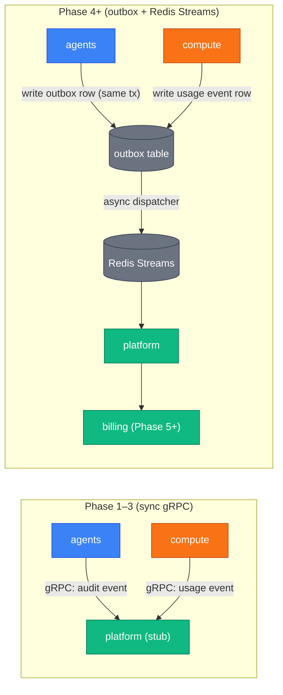

We chose two communication protocols and keep them strictly separated: REST+JSON+SSE for the
public surface, gRPC+Protobuf for internal service-to-service calls. The separation matters
because the two surfaces have different versioning and stability requirements. Public REST
contracts are stable once released; internal gRPC contracts can move faster because both
ends of the call are under our control and deployed together.

## The two protocols

| Surface                   | Protocol               | Schema source          | When used                                         |
| ------------------------- | ---------------------- | ---------------------- | ------------------------------------------------- |
| Public                    | REST + JSON            | proto HTTP annotations | Client → gateway (Phase 7) or service (Phase 1–6) |
| Public                    | SSE                    | text/event-stream      | LLM token streaming from agents                   |
| Internal                  | gRPC + Protobuf        | `paper-board/proto`    | Service → service                                 |
| Cross-cutting (Phase 1–3) | gRPC sync              | `paper-board/proto`    | audit, usage emit                                 |
| Cross-cutting (Phase 4+)  | Redis Streams + outbox | protobuf envelope      | audit, usage fanout                               |

### REST + JSON (public)

The public API follows REST conventions. Request and response shapes are defined in
`paper-board/proto` using `option (google.api.http)` annotations. `grpc-gateway` generates
the HTTP/JSON translation layer; OpenAPI specs are auto-generated from the same annotations.

The `agents` service exposes its REST surface on port 8080 today. In Phase 7, `gateway`
moves in front and the per-service HTTP ports become cluster-internal only.

### SSE (streaming)

LLM token streams use Server-Sent Events (`Content-Type: text/event-stream`). The `agents`
service proxies the Anthropic streaming response token-by-token as SSE frames. The client
receives a stream of `data:` lines followed by a final `data: [DONE]` sentinel.

We chose SSE over WebSockets because SSE is unidirectional (server → client only) and maps
naturally to the LLM streaming model. It also degrades gracefully through HTTP/2 multiplexing
without upgrade negotiation.

### gRPC + Protobuf (internal)

All service-to-service calls use gRPC. The `.proto` files in `paper-board/proto` are the
single source of truth — no hand-written client stubs, no shared struct packages.
`buf generate` produces Go and TypeScript clients. `buf breaking` in CI prevents
backwards-incompatible contract changes from landing silently.

Service discovery in Phases 1–5 uses Kubernetes Service DNS:
`<svc>.paper-board.svc.cluster.local:<grpc-port>`. Client-side load balancing replaces this
in Phase 6+.

## Request flow — end to end

```mermaid
sequenceDiagram
  autonumber
  participant Client as Client (browser / CLI)
  participant Agents as agents :8080
  participant Identity as identity :50052
  participant Runtime as runtime :50053
  participant Compute as compute :50054
  participant Anthropic as Anthropic API

  classDef controlPlane fill:#10b981,stroke:#047857,color:#fff
  classDef dataPlane fill:#3b82f6,stroke:#1d4ed8,color:#fff
  classDef sandbox fill:#f97316,stroke:#c2410c,color:#fff
  classDef external fill:#ef4444,stroke:#b91c1c,color:#fff
  classDef persistence fill:#6b7280,stroke:#374151,color:#fff

  Client->>Agents: POST /v1/agents/{id}/messages<br/>Authorization: Bearer <JWT>
  Agents->>Identity: gRPC AuthService.VerifyToken<br/>→ {user_id, org_id, roles}
  Identity-->>Agents: claims
  Agents->>Agents: reserve budget (agents schema)
  Agents->>Anthropic: streaming inference request
  Anthropic-->>Agents: token stream
  Agents->>Runtime: gRPC RuntimeService.Dispatch (stream)
  Runtime->>Compute: gRPC ComputeService.ExecCommand
  Compute-->>Runtime: stdout/stderr + usage_event_id
  Runtime-->>Agents: execution result
  Agents-->>Client: SSE stream (text/event-stream)<br/>data: {token}<br/>data: [DONE]
```

Auth propagation: `agents` verifies the JWT once by calling identity's `AuthService`. It
extracts `user_id`, `org_id`, and `roles` from the claims and forwards them to downstream
services via gRPC metadata headers (`x-user-id`, `x-org-id`, `x-roles`, `x-trace-id`).
Downstream services (`runtime`, `compute`) trust these headers without re-calling identity.

## Sync vs async — the Phase 4 transition

Through Phase 3, all cross-cutting calls (audit writes, usage event recording) are
synchronous gRPC. This is simpler to reason about and sufficient for a single-digit customer
count.

From Phase 4, we switch cross-cutting concerns to the outbox + Redis Streams pattern. The
motivation: a synchronous audit write in the critical path of an LLM response stream adds
latency and creates a failure mode (audit service down → entire session blocked). With the
outbox, the domain write and the outbox row happen atomically in one transaction; the async
dispatcher handles fanout separately.



The outbox pattern provides at-least-once delivery with idempotency keys. A consumer that
crashes mid-processing will receive the event again on restart and must handle the duplicate
gracefully.

## Auth propagation

```
Client → agents (verifies JWT with identity) → runtime (trusts x-user-id header)
                                             → compute (trusts x-user-id header)
```

The JWT is verified exactly once per request chain. Downstream services receive decoded
claims as gRPC metadata and do not make additional calls to identity. This keeps the
identity service out of the hot path for internal-only calls.

In Phase 7, `gateway` takes over JWT verification. All downstream services will trust the
metadata headers that gateway forwards, exactly as they trust the per-service verification
today.

## mTLS

Phases 1–4 use NetworkPolicy default-deny: pods cannot reach each other unless a
NetworkPolicy explicitly allows it. This is "security by firewall" — sufficient for a
private cluster with a small team.

Phase 5+ adds mTLS via cert-manager: every gRPC call is mutually authenticated with
short-lived certificates. NetworkPolicy remains as defense-in-depth.

## Service discovery

| Phase | Mechanism                                       |
| ----- | ----------------------------------------------- |
| 1–5   | Kubernetes Service DNS (stable, no code needed) |
| 6+    | Client-side load balancing (gRPC-native)        |

During Phases 1–5 the DNS address is the gRPC target:
`identity.paper-board.svc.cluster.local:50052`. No service mesh, no sidecar, no Envoy at
this stage — that complexity is deferred until Phase 6 when multi-tenant scale makes it
worth paying for.

## Where to go next

- [Data plane vs control plane](./data-plane-control-plane.md) — runtime and compute roles.
- [Service map](./service-map.md) — port and gRPC service name per service.
