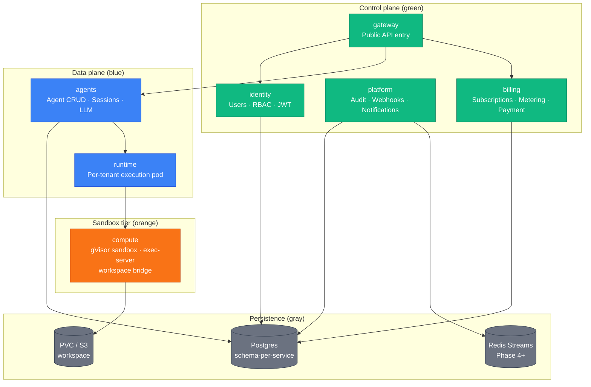

We draw a hard line between two tiers in the paperboard architecture: the **control plane**
and the **data plane**. This split is not cosmetic — it drives scaling decisions, failure
isolation design, and the Phase 3 substrate that runtime and compute implement.

## Definitions

**Control plane** — services that own durable configuration, identity state, billing ledgers,
and orchestration logic. They are modified infrequently relative to request traffic.
A control-plane service failure degrades new session starts but does not interrupt sessions
already running.

**Data plane** — services that execute live user requests. They are on the critical path for
every agent message. A data-plane failure directly interrupts in-flight sessions.

**Sandbox tier** — a sub-tier of the data plane that executes untrusted code. It is isolated
at the kernel syscall level via gVisor and receives its own color in all diagrams (orange)
to make the security boundary visually obvious.

## Color-coded diagram



## Control plane in depth

Control-plane services are stateful (each owns a Postgres schema) and change slowly. We
designed them to be on the path for session initialization but not for token streaming.

**identity** is called at the start of every authenticated request to verify the JWT and
resolve RBAC claims. In Phases 1–6, each service calls identity directly; in Phase 7,
gateway takes over and identity moves off the per-request critical path for most endpoints.

**platform** owns the audit log and webhook fanout. Through Phase 3 it receives usage events
synchronously via gRPC; from Phase 4 it consumes the outbox asynchronously. This is the
transition point where a control-plane service deliberately moves itself off the hot path.

**billing** owns the subscription ledger and pricing engine. It is called during session
start (budget reservation) and session close (settlement), not during the token stream. A
billing outage blocks new session starts but does not interrupt streaming sessions already
in flight.

**gateway** (Phase 7) is stateless despite being in the control plane. It owns no Postgres
schema. We classify it as control plane because it enforces policy (rate limits, auth,
idempotency) rather than executing user intent.

## Data plane in depth

Data-plane services are on the critical path for every token in a streaming response. We
design them to fail fast and independently, not to degrade gracefully.

**agents** receives the user message, dispatches LLM inference to the Anthropic API, and
proxies the response as an SSE stream. It owns the session event store and artifact
metadata. agents is the integration point between the control plane (budget reservation,
auth claims) and the data plane execution path.

**runtime** is the per-tenant execution pod. It is intentionally stateless — it holds no
durable state, owns no schema, and can be restarted without data loss. Its only job is to
bridge a gRPC stream from agents to compute and back. We built it as a separate service
(rather than embedding this logic in agents) because the per-tenant isolation boundary is
at the pod level, and agents is a shared service.

## Phase 3 as the canonical example

Phase 3 (runtime + compute + workspace sandbox + metering hooks) is the clearest illustration
of the control/data/sandbox split in practice.

```mermaid
sequenceDiagram
  autonumber
  participant Agents as agents (data plane)
  participant Runtime as runtime (data plane)
  participant Compute as compute (sandbox tier)
  participant PVC as workspace PVC
  participant S3 as S3

  classDef controlPlane fill:#10b981,stroke:#047857,color:#fff
  classDef dataPlane fill:#3b82f6,stroke:#1d4ed8,color:#fff
  classDef sandbox fill:#f97316,stroke:#c2410c,color:#fff
  classDef external fill:#ef4444,stroke:#b91c1c,color:#fff
  classDef persistence fill:#6b7280,stroke:#374151,color:#fff

  Agents->>Runtime: RuntimeService.Dispatch(session_id, prompt)
  Runtime->>Compute: ComputeService.CreateSandbox(org_id, session_id)
  Compute->>PVC: mount workspace PVC (restore from S3 if exists)
  PVC-->>Compute: workspace ready
  Runtime->>Compute: ComputeService.ExecCommand(code)
  Compute->>Compute: execute inside gVisor boundary
  Compute-->>Runtime: {stdout, stderr, exit_code, usage_event_id}
  Runtime->>Compute: ComputeService.DestroySandbox
  Compute->>S3: flush workspace PVC to S3
  Compute-->>Runtime: destroyed
  Runtime-->>Agents: execution result + usage_event_id
```

The gVisor boundary (`CreateSandbox` → `DestroySandbox`) marks the sandbox tier. Everything
that executes between those two calls is inside the syscall-intercepting gVisor runtime.
Code running inside the sandbox cannot make raw syscalls to the host kernel — gVisor
intercepts and handles them in user space.

The `usage_event_id` returned by `DestroySandbox` is the metering hook: it records
pod-seconds elapsed, tool-call count, and workspace-minutes for the session. This is why
metering had to land in Phase 3 — the event must be emitted at the sandbox boundary where
the actual resource consumption is measured.

## Failure isolation matrix

| Failure                   | Impact on running sessions       | Impact on new session starts |
| ------------------------- | -------------------------------- | ---------------------------- |
| identity down             | None (claims already verified)   | Blocked (JWT unverifiable)   |
| platform down (Phase 1–3) | Audit writes fail synchronously  | Possible degradation         |
| platform down (Phase 4+)  | None (outbox buffers events)     | None                         |
| billing down              | None (in-flight session runs)    | Blocked (budget reservation) |
| agents down               | All sessions interrupted         | Blocked                      |
| runtime down              | Sessions on that pod interrupted | New dispatch blocked         |
| compute down              | Code execution blocked           | Code execution blocked       |

The Phase 4 platform async transition directly improves the "platform down" row: moving
audit fanout off the synchronous gRPC path eliminates the failure mode where an audit
service restart interrupts in-flight sessions.

## Scaling profile differences

Control-plane services scale with the number of organizations and configuration changes —
roughly linear with customer count, slow-moving. Data-plane services scale with concurrent
session count and request rate — spiky, directly tied to usage.

We keep them in separate Kubernetes Deployments with separate Horizontal Pod Autoscaler
configs. Control-plane services scale conservatively; data-plane services scale aggressively.
The sandbox tier (`compute`) scales per tenant — one pod per active `(org_id, image_digest)`
tuple at steady state, with the K8s reconciler managing lifecycle in Phase 6+.

## Where to go next

- [Communication patterns](./communication-patterns.md) — sync vs async, auth propagation.
- [Service map](./service-map.md) — port and schema reference per service.
- [System overview](./system-overview.md) — the full 12-repo picture.
