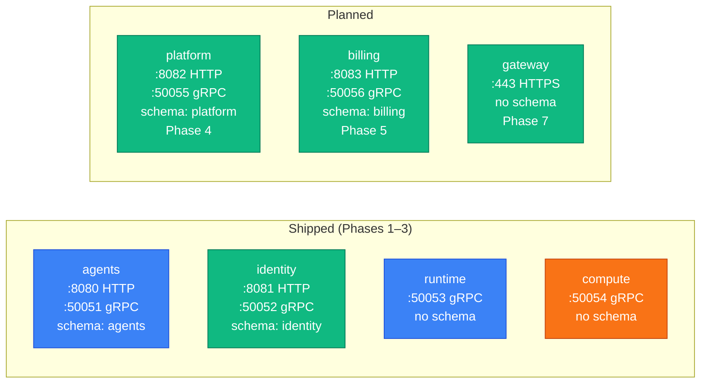

Quick reference for every repo in the `paper-board` org: what port it listens on, which
Postgres schema it owns, and which phase it shipped in.

## Backend services



| Repo                   | HTTP port | gRPC port | Schema     | Phase | Status  |
| ---------------------- | --------- | --------- | ---------- | ----- | ------- |
| `paper-board/agents`   | 8080      | 50051     | `agents`   | 1.1   | ✅      |
| `paper-board/identity` | 8081      | 50052     | `identity` | 2     | ✅      |
| `paper-board/runtime`  | —         | 50053     | none       | 3     | ✅      |
| `paper-board/compute`  | —         | 50054     | none       | 3     | ✅      |
| `paper-board/platform` | 8082      | 50055     | `platform` | 4     | planned |
| `paper-board/billing`  | 8083      | 50056     | `billing`  | 5     | planned |
| `paper-board/gateway`  | 443       | —         | none       | 7     | planned |

### agents (Phase 1.1 ✅)

Agent definitions and versions, sessions, budget reservations, memory collections, and
artifact metadata. The product from the user's perspective. Dispatches to the Anthropic API
for LLM inference; relays the response as an SSE stream to the caller.

- **REST:** `POST /v1/agents`, `POST /v1/agents/{id}/messages` (SSE), `GET /v1/agents/{id}`
- **gRPC:** `agents.v1.AgentsService` (internal callers: runtime, compute)
- **DB user:** `agents_app`
- **Advisory lock id:** 3
- **GHCR images:** `ghcr.io/paper-board/agents-server`, `ghcr.io/paper-board/agents-migrator`

### identity (Phase 2 ✅)

Users, organizations, RBAC, JWT signing, MFA, API keys, refresh-token rotation, invitations,
and idempotency cache. Every other service trusts identity's JWT — no cross-service JWT
re-verification.

- **REST:** `POST /v1/orgs`, `POST /v1/tokens`, `POST /v1/users`, `POST /v1/api-keys`
- **gRPC:** `identity.v1.IdentityService`, `identity.v1.AuthService`
- **DB user:** `identity_app`
- **Advisory lock id:** 1
- **GHCR images:** `ghcr.io/paper-board/identity-server`, `ghcr.io/paper-board/identity-migrator`

### runtime (Phase 3 ✅)

Per-tenant data-plane pod. Stateless — no Postgres schema, no persistent state. Receives
prompts from `agents` via gRPC stream, holds the agent definition in memory for the session,
and dispatches code execution to `compute`.

- **gRPC:** `runtime.v1.RuntimeService` (called by: agents)
- **DB user:** none
- **GHCR images:** `ghcr.io/paper-board/runtime-server`

### compute (Phase 3 ✅)

gVisor sandbox host and exec-server. Receives `ExecCommand` calls from `runtime`, executes
code inside an isolated gVisor pod, returns stdout/stderr, writes artifact metadata back to
`agents`, and emits usage events.

- **gRPC:** `compute.v1.ComputeService` — `CreateSandbox`, `ExecCommand`, `DestroySandbox`
- **DB user:** none
- **GHCR images:** `ghcr.io/paper-board/compute-server`

### platform (Phase 4 — next)

Cross-cutting event hub. Will own audit log (hash-chained from Phase 5), incidents,
notifications, webhooks, exports, and onboarding events. First consumer of usage events
emitted by `compute`.

- **DB user:** `platform_app`
- **Advisory lock id:** 4
- **GHCR images:** `ghcr.io/paper-board/platform-server`, `ghcr.io/paper-board/platform-migrator`

### billing (Phase 5 — planned)

Subscriptions, pricing rates (3-level cascade), usage meter, bill rendering, marketplace
listings and payouts, promo code redemption. Multi-provider payment abstraction from Day 1:
Stripe, iyzico, PayTR, Param.

- **DB user:** `billing_app`
- **Advisory lock id:** 2
- **GHCR images:** `ghcr.io/paper-board/billing-server`, `ghcr.io/paper-board/billing-migrator`

### gateway (Phase 7 — planned)

Public API entry point. Will centralize JWT verification (fetches JWKS from identity), rate
limiting (Redis), idempotency middleware, and routing. Stateless; no Postgres schema.
Phases 1–6 handle auth per-service; Phase 7 moves it here.

- **GHCR images:** `ghcr.io/paper-board/gateway-server`

## Supporting repos

| Repo                   | Purpose                                      | License     |
| ---------------------- | -------------------------------------------- | ----------- |
| `paper-board/sdk`      | Shared Go library (log, obs, auth, migrator) | MIT         |
| `paper-board/proto`    | gRPC `.proto` + OpenAPI source of truth      | MIT         |
| `paper-board/infra`    | Helm umbrella + subcharts + Terraform        | Proprietary |
| `paper-board/frontend` | Next.js admin + customer dashboard + docs    | Proprietary |
| `paper-board/cli`      | `agentctl` customer CLI                      | MIT         |

## Database ownership

Single Postgres cluster; each service owns exactly one schema. Cross-schema foreign keys
are forbidden (ADR-0003) — services reference each other by UUID without FK constraints.

| Schema     | Owner service | DB user        | Advisory lock |
| ---------- | ------------- | -------------- | ------------- |
| `agents`   | agents        | `agents_app`   | 3             |
| `identity` | identity      | `identity_app` | 1             |
| `billing`  | billing       | `billing_app`  | 2             |
| `platform` | platform      | `platform_app` | 4             |

Services with no schema (`runtime`, `compute`, `gateway`) have no DB user and no migrator.

## Kubernetes service DNS

Internal gRPC calls use Kubernetes Service DNS:

```
<service>.paper-board.svc.cluster.local:<grpc-port>
```

Examples:

- `identity.paper-board.svc.cluster.local:50052`
- `agents.paper-board.svc.cluster.local:50051`
- `compute.paper-board.svc.cluster.local:50054`

Client-side load balancing replaces DNS-based discovery in Phase 6+.

## GHCR image naming

```
ghcr.io/paper-board/<service>-<binary>:<semver-tag>
```

Every service ships two images: a `server` image and (for services with a schema) a
`migrator` image. The migrator image runs as the Helm `pre-install` / `pre-upgrade` Job.

## Where to go next

- [Communication patterns](./communication-patterns.md) — REST vs gRPC, sync vs async.
- [Data plane vs control plane](./data-plane-control-plane.md) — runtime/compute roles.
