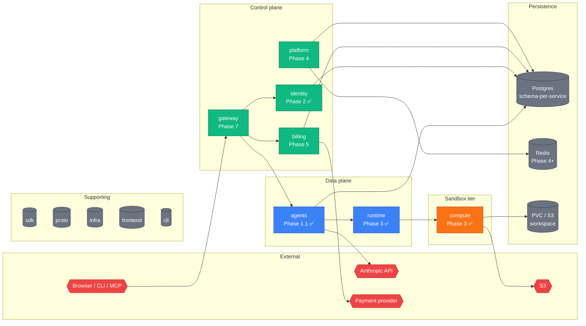
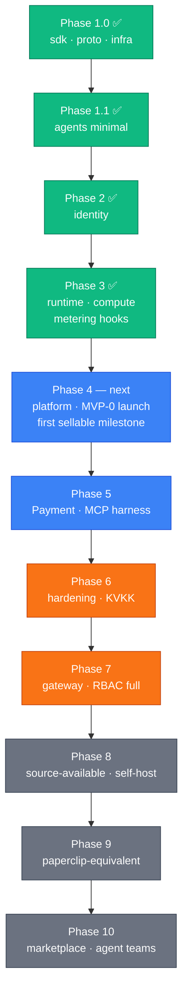

paperboard is a multi-repo microservices platform. We chose this structure deliberately:
each service owns its schema, its release lifecycle, and its scaling profile independently.
The coupling between services is explicit (gRPC contracts in `paper-board/proto`) rather
than implicit (shared database tables). This made early phases faster to ship and will make
Phase 6+ hardening tractable.

## Hero diagram — 12 repos and dataflow

The color coding carries semantic meaning throughout all paperboard diagrams:

| Color  | Role          | Services                                     |
| ------ | ------------- | -------------------------------------------- |
| Green  | Control plane | gateway, identity, platform, billing         |
| Blue   | Data plane    | agents, runtime                              |
| Orange | Sandbox tier  | compute (gVisor boundary)                    |
| Red    | External      | Anthropic API, payment provider, S3, clients |
| Gray   | Persistence   | Postgres, Redis, PVC, sdk, proto, infra      |

## High-level components

### Control plane

The control plane services own configuration, identity, billing state, and orchestration.
They are stateful (each owns a Postgres schema) and change infrequently relative to the data
plane.

**identity** (Phase 2 ✅) manages who is allowed to do what. It owns user accounts,
organizations (tenants), RBAC roles, JWT signing keys, MFA, API keys, and invitation flows.
Every other service trusts identity's JWT claims; they do not re-verify signatures.

**platform** (Phase 4) is the cross-cutting event hub. It owns the audit log, incidents,
notifications, webhooks, and onboarding events. From Phase 4+, platform is the first consumer
of usage events emitted by `compute` — it aggregates metering data that `billing` later reads.

**billing** (Phase 5) owns subscriptions, pricing rates, and the payment abstraction layer.
We chose to keep billing as a single cohesive context rather than split it into separate
subscription-service and payment-service because the coupling between pricing rules and
payment provider state is tight enough that splitting would create more coordination overhead
than it saves.

**gateway** (Phase 7) is the public API entry point. It centralizes JWT verification, rate
limiting (Redis), and idempotency middleware. Phases 1–6 handle auth per-service; Phase 7
moves it here. We deferred gateway because centralization before the auth contracts stabilize
creates churn.

### Data plane

**agents** (Phase 1.1 ✅) is the product itself from the user's perspective. It owns agent
definitions and versions, sessions (the event store), budget reservations, memory collections
(pgvector in Phase 5+), and artifact metadata. When a user sends a message, `agents` receives
it, dispatches to the Anthropic API for LLM inference, and streams the response back via SSE.

**runtime** (Phase 3 ✅) is the per-tenant execution pod. It is stateless — it holds no
persistent state of its own. Its role is to receive a prompt from `agents`, fetch the agent
definition, and dispatch the actual code execution down to `compute`. One runtime pod per
`(org_id, image_digest)` tuple at steady state.

### Sandbox tier

**compute** (Phase 3 ✅) runs code in gVisor-isolated pods. It is the security boundary:
anything a user's agent does that touches the file system or network happens inside a gVisor
sandbox. After execution, compute emits usage events (pod-seconds, tool-calls,
workspace-minutes) and flushes workspace state to S3 via the workspace bridge sidecar.

### Supporting repos

**sdk** (`paper-board/sdk`) is the shared Go library. It ships `log`, `obs` (OTel), `auth/middleware`,
`migrator`, and shared `errors`. It is MIT-licensed (open core) and SemVer-disciplined.

**proto** (`paper-board/proto`) is the single source of truth for all gRPC and HTTP contracts.
`buf generate` produces Go + TypeScript clients. Consuming services bump the proto dependency
to pick up contract changes.

**infra** (`paper-board/infra`) holds the Helm umbrella chart, per-service subcharts,
Terraform, and Kubernetes manifests. The Helm chart version mirrors the service version.

## Phase ladder

We build in vertical slices per ADR-0015. The key structural decision driving the phase
order: paperboard's revenue model is compute markup, not token markup. This means metering
infrastructure had to land in Phase 3 (not Phase 8 as originally planned) and the billing
engine in Phase 5.

Phase 4 is the first sellable milestone (MVP-0): platform + audit + onboarding + one agent
template + BYO API key + manual email invoice.

## Design decisions

The major cross-cutting decisions are recorded as ADRs:

| ADR  | Decision                                          |
| ---- | ------------------------------------------------- |
| 0001 | Multi-repo (12 repos, each with its own `go.mod`) |
| 0002 | Schema-per-service (single Postgres cluster)      |
| 0003 | No cross-schema FK — UUID-by-reference only       |
| 0004 | Shared migrator SDK                               |
| 0005 | REST public + gRPC internal                       |
| 0015 | MVP-first phase ordering (amends ADR-0014)        |

See the full [Decisions index](../decisions/) for all ADRs.

## Where to go next

- [Service map](./service-map.md) — port, schema, and phase per service.
- [Communication patterns](./communication-patterns.md) — REST vs gRPC, sync vs async.
- [Data plane vs control plane](./data-plane-control-plane.md) — the split explained.
