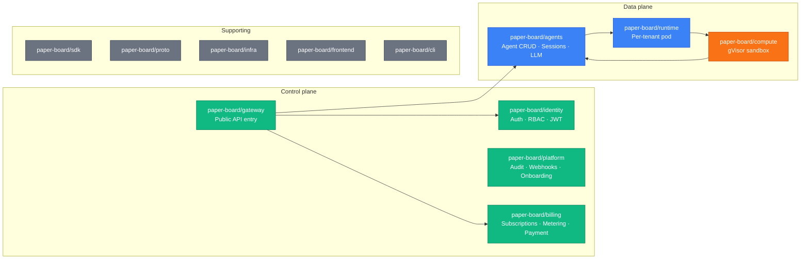

paperboard is an agent execution platform: customers bring an Anthropic API key, describe an agent,
and paperboard handles the sandboxed compute, metering, and workspace lifecycle. We bill for
pod-seconds, tool-call counts, and workspace-minutes — not for tokens.

The platform lives across 12 GitHub repositories under the `paper-board` org. Seven are runtime
services written in Go; five are supporting libraries, tooling, and infrastructure.

## The 12 repositories

### Backend services (7)

| Repo                   | Responsibility                                         | Schema     | Phase shipped |
| ---------------------- | ------------------------------------------------------ | ---------- | ------------- |
| `paper-board/gateway`  | Public API entry, auth middleware, routing (stateless) | none       | 7             |
| `paper-board/identity` | Users, orgs, RBAC, JWT, MFA, API keys, invitations     | `identity` | 2 ✅          |
| `paper-board/agents`   | Agent CRUD, sessions, prompt pipeline, LLM dispatch    | `agents`   | 1.1 ✅        |
| `paper-board/runtime`  | Per-tenant data plane pod (stateless)                  | none       | 3 ✅          |
| `paper-board/billing`  | Subscriptions, pricing, metering, Payment, marketplace | `billing`  | 5             |
| `paper-board/platform` | Audit, incidents, notifications, webhooks, onboarding  | `platform` | 4             |
| `paper-board/compute`  | gVisor sandbox, exec-server, workspace bridge          | none       | 3 ✅          |

### Supporting (5)

| Repo                   | Purpose                                                |
| ---------------------- | ------------------------------------------------------ |
| `paper-board/sdk`      | Shared Go library: log, obs, auth middleware, migrator |
| `paper-board/proto`    | gRPC `.proto` + OpenAPI specs — single source of truth |
| `paper-board/infra`    | Helm umbrella + subcharts + Terraform + k8s manifests  |
| `paper-board/frontend` | Next.js admin + customer dashboard + this docs site    |
| `paper-board/cli`      | `agentctl` — customer command-line interface           |

## Phase ladder

We build paperboard in vertical slices, shipping one phase at a time. Each phase is a demoable
and (from Phase 4 onwards) sellable increment.

| Phase | What ships                                                    | Status     |
| ----- | ------------------------------------------------------------- | ---------- |
| 1.0   | sdk + proto + infra v0.1.0                                    | ✅ shipped |
| 1.1   | agents minimal: 3 tables + REST + SSE + Anthropic LLM         | ✅ shipped |
| 2     | identity: AuthService, RBAC, JWT, API keys                    | ✅ shipped |
| 3     | runtime + compute + workspace sandbox + metering hooks        | ✅ shipped |
| 4     | platform + MVP-0 launch (first sellable milestone)            | next       |
| 5     | Payment (Stripe + iyzico + PayTR + Param) + multi-harness MCP | planned    |
| 6     | Production hardening + multi-user org + KVKK                  | planned    |
| 7     | gateway centralize + RBAC full                                | planned    |
| 8     | Source-available + self-host enterprise tier                  | planned    |
| 9     | paperclip-equivalent platform layer                           | planned    |
| 10    | Marketplace + pre-built agent teams + agent-to-agent protocol | planned    |

Phase order is set by [ADR-0015](../../decisions/0015-mvp-launch-phase-rebalance.md).
The key insight driving the ordering: our revenue model is **compute markup**, not token markup.
This means metering must land in Phase 3 (Day 1) and billing in Phase 5 — not Phase 8 as
originally planned.

## Where to go next

- [Local dev setup](./local-dev-setup.md) — get a running paperboard environment on your laptop.
- [First PR](./first-pr.md) — branch naming, Conventional Commits, CI + CodeRabbit workflow.
- [Glossary](./glossary.md) — 30+ terms defined precisely.
- [System overview](../architecture/system-overview.md) — deep dive into the architecture.
