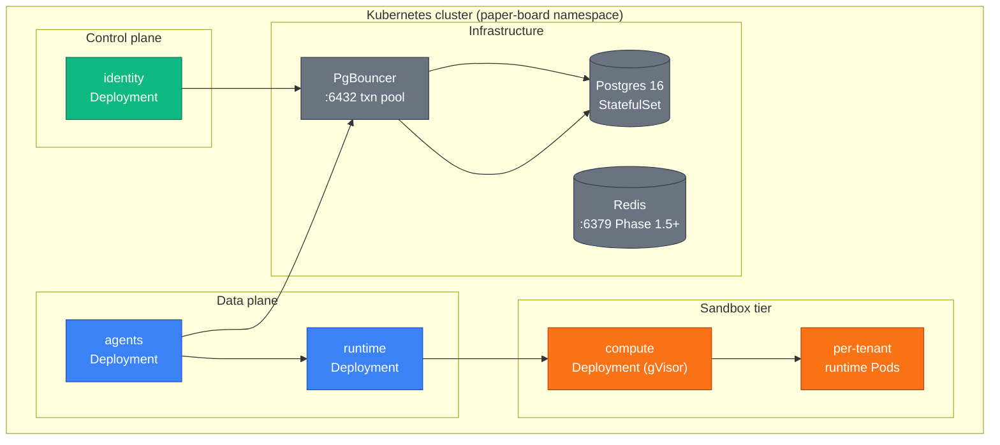
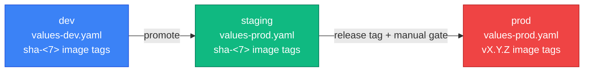

paper-board deploys via a single Helm umbrella chart (`paper-board/infra/helm/agent-manager`)
that includes all services, infrastructure subcharts, and the migrator Job hook. Service images
come from GHCR.

## Helm chart layout

```
paper-board/infra/helm/agent-manager/
├── Chart.yaml          ← umbrella chart; lists per-service OCI deps + local subcharts
├── Chart.lock
├── values.yaml         ← defaults (all services disabled by default; opt-in per env)
├── values-dev.yaml     ← dev overrides
├── values-prod.yaml    ← prod overrides
├── charts/             ← local subcharts
│   ├── postgres/       ← Postgres 16 statefulset + init-db.sql
│   ├── pgbouncer/      ← PgBouncer transaction-pool proxy (mandatory, no condition)
│   ├── cert-manager/   ← Phase 5+
│   └── redis/          ← Phase 1.5+
└── templates/
    ├── _helpers.tpl
    ├── agents-app-db-url-secret.yaml
    └── identity-app-db-url-secret.yaml
```

Per-service charts are published as OCI artifacts and consumed as dependencies:

```yaml
# from paper-board/infra/helm/agent-manager/Chart.yaml:27-34
dependencies:
  - name: identity
    version: 0.2.1
    repository: oci://ghcr.io/paper-board/helm
    condition: identity.enabled
  - name: agents
    version: 0.2.3
    repository: oci://ghcr.io/paper-board/helm
    condition: agents.enabled
```

## Deployment topology



## Migrator hook

Each service ships a `cmd/migrator` binary. Helm runs it as a `pre-install` / `pre-upgrade`
Job hook before any Pod rolls out. The migrator acquires a Postgres advisory lock (per-service
ID) so parallel chart upgrades never interleave migrations.

Advisory lock IDs: `identity=1`, `billing=2`, `agents=3`, `platform=4`.

The migrator connects via `MIGRATION_DB_URL` (port 5432, direct Postgres — **not** port 6432
PgBouncer). Advisory locks require a session-mode connection; PgBouncer in transaction-pool
mode drops them between statements.

```yaml
# Helm hook annotation on the migrator Job (in each service chart)
annotations:
  "helm.sh/hook": pre-install,pre-upgrade
  "helm.sh/hook-weight": "-5"
  "helm.sh/hook-delete-policy": before-hook-creation,hook-succeeded
```

Migration commands (via `sdk/migrator`):

```sh
# run all pending migrations
migrator up

# dry run — print SQL without executing
migrator up --dry-run

# roll back N steps
migrator down 1

# force-set version (emergency only)
migrator force 000005

# show current version
migrator version

# drop schema (dev only — requires MIGRATOR_ENV=dev)
migrator drop
```

## Image naming

Pattern: `ghcr.io/paper-board/<svc>-<binary>:<tag>`

| Binary     | Example                                      |
| ---------- | -------------------------------------------- |
| `server`   | `ghcr.io/paper-board/agents-server:v0.3.0`   |
| `migrator` | `ghcr.io/paper-board/agents-migrator:v0.3.0` |

Three tags per release: `vX.Y.Z` (prod), `sha-<7>` (staging), `latest` (dev only).
`latest` MUST NOT appear in any committed Helm values file.

## DB user model (PoLP)

One DB user per service; each has `USAGE` on its own schema only.

| User           | Schema     | Phase created |
| -------------- | ---------- | ------------- |
| `identity_app` | `identity` | 2             |
| `agents_app`   | `agents`   | 1.1           |
| `billing_app`  | `billing`  | 5             |
| `platform_app` | `platform` | 4             |

Passwords are injected at deploy time via Kubernetes Secrets referenced in `values.yaml`.
Cross-schema foreign keys are forbidden (ADR-0003). Cross-service consistency uses
UUID-by-reference + outbox events (Phase 4+).

## Environment promotion



### Deploy commands

```sh
# update chart dependencies
helm dependency update paper-board/infra/helm/agent-manager

# dev deploy
helm upgrade --install agent-manager paper-board/infra/helm/agent-manager \
  -f paper-board/infra/helm/agent-manager/values-dev.yaml \
  -n paper-board --create-namespace

# prod deploy (explicit image tag)
helm upgrade --install agent-manager paper-board/infra/helm/agent-manager \
  -f paper-board/infra/helm/agent-manager/values-prod.yaml \
  --set agents.image.tag=v0.3.0 \
  --set identity.image.tag=v0.3.0 \
  -n paper-board

# check migrator Job completed before rollout
kubectl wait job/<svc>-migrator -n paper-board --for=condition=complete --timeout=120s

# verify rollout
kubectl rollout status deployment/agents -n paper-board
```

### Rollback

```sh
helm history agent-manager -n paper-board
helm rollback agent-manager <revision> -n paper-board
```

## Service discovery

Internal gRPC calls use Kubernetes Service DNS:

```
<svc>.paper-board.svc.cluster.local:50051
```

No client-side LB in Phases 1-5. Phase 6+ adds it. `identityGrpcEndpoint` in `values.yaml`
overrides the default for cross-namespace or cross-cluster scenarios.

## Network policy

`networkPolicy.enabled: true` in each service chart activates a default-deny policy;
only declared ingress/egress ports are permitted. mTLS is Phase 5+ (cert-manager).
