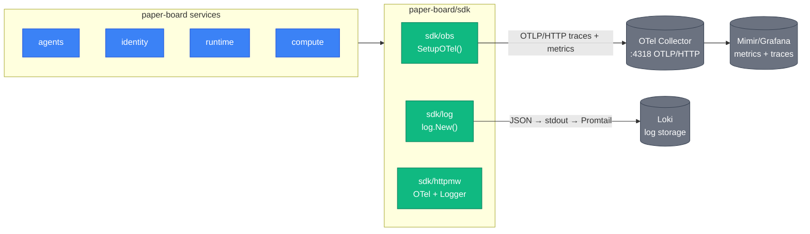

Every paper-board service shares an observability stack wired through `paper-board/sdk`:
`sdk/obs` for OTel setup, `sdk/log` for structured JSON logging, `sdk/httpmw` for HTTP
instrumentation. No per-service setup is required beyond calling `obs.SetupOTel` and
`log.New` in `cmd/server/main.go`.

## Stack overview



## OTel setup

Call `obs.SetupOTel` once in `cmd/server/main.go`. Returns a shutdown function; defer it.

```go
// from paper-board/sdk/obs/otel.go:1-10
type Shutdown func(context.Context) error

func SetupOTel(serviceName, version string) (Shutdown, error)
```

Exporter: **OTLP/HTTP** (not gRPC). Empty `OTEL_EXPORTER_OTLP_ENDPOINT` produces a no-op
exporter — the service starts and runs without a collector present.

### OTel env vars

| Env var                       | Default | Notes                                                                |
| ----------------------------- | ------- | -------------------------------------------------------------------- |
| `OTEL_EXPORTER_OTLP_ENDPOINT` | `""`    | Full URL: `http://otel-collector.observability:4318`. Empty = no-op. |
| `OTEL_SERVICE_VERSION`        | `dev`   | semver or git SHA                                                    |
| `OTEL_TRACES_SAMPLER_ARG`     | `1.0`   | Head sampling fraction                                               |
| `OTEL_RESOURCE_ATTRIBUTES`    | `""`    | Extra resource attrs e.g. `deployment.environment=staging`           |

## Structured logging

All log output is JSON via `sdk/log`. Use `log.Pkg(ctx)` inside handlers to emit the full
canonical key set automatically.

### Canonical keys

| Key           | Type   | Required when                |
| ------------- | ------ | ---------------------------- |
| `service`     | string | always                       |
| `request_id`  | string | inside HTTP handler          |
| `trace_id`    | string | OTel active                  |
| `span_id`     | string | OTel active                  |
| `org_id`      | uuid   | auth middleware ran          |
| `user_id`     | uuid   | auth ran in JWT mode         |
| `api_key_id`  | uuid   | auth ran in API-key mode     |
| `session_id`  | uuid   | request bound to a session   |
| `agent_id`    | uuid   | request bound to an agent    |
| `event_type`  | string | session_event lifecycle logs |
| `error`       | string | warn/error log               |
| `error.kind`  | string | sentinel-typed errors        |
| `duration_ms` | int    | request-scoped final log     |

Service-specific keys MUST carry a `<service>.` prefix (e.g. `billing.invoice_id`).
Redefining a canonical key with different semantics is forbidden.

### Context helpers

```go
// from paper-board/sdk/log/pkg.go:1-6
func WithSpan(ctx context.Context, span trace.Span) context.Context
func WithSession(ctx context.Context, id uuid.UUID) context.Context
func WithAgent(ctx context.Context, id uuid.UUID) context.Context
```

### Log levels

| Level   | Default? | Notes                                                   |
| ------- | -------- | ------------------------------------------------------- |
| `INFO`  | yes      | default in all environments including docker-compose    |
| `DEBUG` | no       | local docker-compose only; MUST NOT be default deployed |
| `WARN`  | —        | emits `slog.Source` (file:line)                         |
| `ERROR` | —        | emits `slog.Source` (file:line)                         |

Override: `LOG_LEVEL=debug|info|warn|error`. Validated at startup.

`go test` runs mute INFO/DEBUG noise via `sdk/testfixture.MuteLogger(t)`.

## Trace propagation

### HTTP inbound

`sdk/httpmw.OTel` extracts `traceparent` / `tracestate` (W3C TraceContext) and starts the
server span. Span name: `<METHOD> <route_pattern>` (e.g. `POST /v1/sessions/{id}/prompt`).

### HTTP outbound

All outbound HTTP clients MUST wrap the transport:

```go
// from paper-board/agents/internal/llm/anthropic/client.go:1-5
httpClient := &http.Client{
    Transport: otelhttp.NewTransport(http.DefaultTransport),
    Timeout:   30 * time.Second,
}
```

Direct `http.DefaultClient` is forbidden in production code paths. This applies to LLM clients,
Stripe, and any other external HTTP.

### gRPC

Servers install `otelgrpc.NewServerHandler()` (stats-handler API). Clients use
`otelgrpc.NewClientHandler()`. ADR-0005 `x-trace-id` metadata is populated automatically by
the OTel handler.

### SSE — special handling

- One server span covers the entire SSE response lifecycle. No per-event spans (floods Grafana
  at ~100 events per high-token stream).
- Pass `r.Context()` to `llm.Stream(ctx, ...)`. Each Anthropic round-trip becomes a child span
  via `otelhttp.NewTransport`.
- SSE-emitting services MUST persist `trace_id` on every event row in the DB to enable
  cross-system event ↔ trace correlation.

## Metrics

Services emit via the OTel SDK (`go.opentelemetry.io/otel/metric`). Services MUST NOT expose
a `/metrics` endpoint. The OTel Collector converts OTLP metrics to Prometheus-compatible
scrape targets consumed by Grafana/Mimir.

### Standard metric names

| Metric                           | Type      | Labels                      | Emitted by              |
| -------------------------------- | --------- | --------------------------- | ----------------------- |
| `http.server.request.duration`   | histogram | route, method, status_class | `sdk/httpmw.Logger`     |
| `http.server.requests.in_flight` | gauge     | route                       | `sdk/httpmw.Logger`     |
| `db.client.query.duration`       | histogram | operation, table            | `sdk/store` query hooks |
| `agents.llm.tokens_in`           | counter   | model                       | agents service          |
| `agents.llm.tokens_out`          | counter   | model                       | agents service          |
| `agents.llm.stream.duration`     | histogram | model, status               | agents service          |

Service-specific metrics MUST be prefixed `<service>.`. Route labels MUST use the chi route
*pattern* (`/v1/sessions/{id}`), never the actual path. Metric labels MUST NOT carry
`user_id` or `org_id` — use OTel exemplars instead.

## Sensitive-data redaction

`sdk/log/redact.go` wraps the `slog.Handler` and is default-on in `sdk/log.New`. It scrubs:

| Pattern                      | Replaced with         |
| ---------------------------- | --------------------- |
| `sk-[A-Za-z0-9_-]{20,}`      | `sk-***`              |
| `Bearer [A-Za-z0-9._-]{20,}` | `Bearer ***`          |
| email addresses              | `***@***`             |
| 16-digit card-shaped numbers | `**** **** **** ****` |
| `postgres://user:pass@`      | `postgres://***:***@` |

Attribute keys named `password`, `secret`, `api_key`, `token`, `authorization`, `x_api_key`,
`cookie` are always replaced with `***` regardless of value content.

Redaction is a defense layer, not a guarantee. The primary control: never pass secret-bearing
struct fields directly to `slog`.

## No Sentry

Sentry is not used. OTel + Loki captures every error with full context. When error triage
becomes a bottleneck, the integration path is a `slog.Handler` wrapper in `sdk/log` mirroring
`ERROR`-level records — no per-service change needed.
