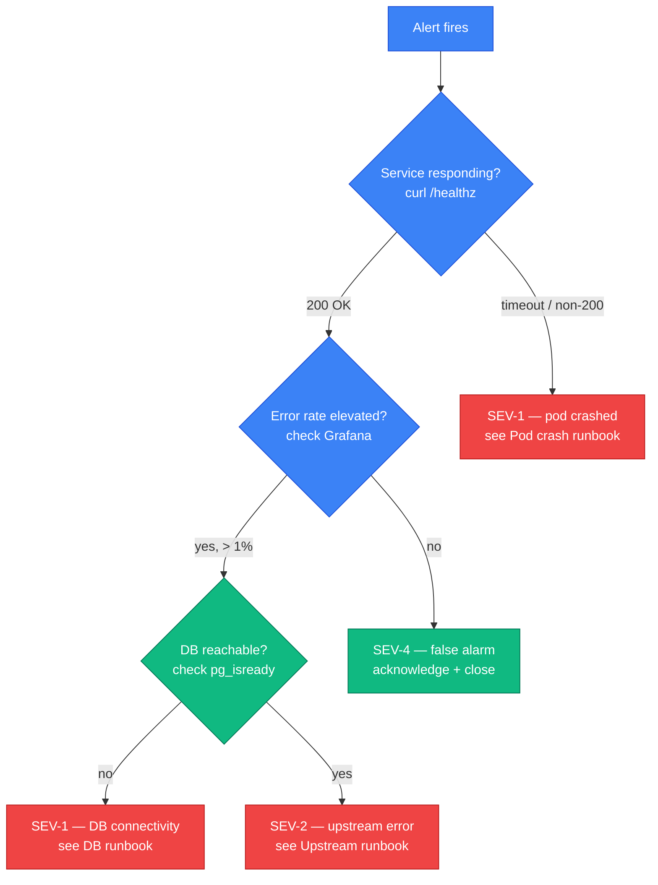

This page is a template skeleton. When a service develops operational history — repeated pages,
known failure modes, or an on-call rotation — copy it into `paper-board/<service>/docs/runbook.md`
and fill in the sections below. The goal is a single document an engineer can open at 2 am
without context and find the next action within 30 seconds.

Good runbooks are terse and imperative. They answer "if X, do Y" — not "here is a general
explanation of X." The narrative sections (Background, Architecture) belong in the service
Overview; runbooks are decision trees.

## Template (copy from here)

______________________________________________________________________

### `<service-name>` runbook

**Last updated:** YYYY-MM-DD
**Owner:** `@paper-board/<svc>-maintainers`
**On-call contact:** _placeholder — Phase 4 fills PagerDuty rotation_
**Dashboard:** `https://grafana.paperboard.internal/d/<svc>`
**Logs:** Loki query `{service="<svc>"}` in Grafana

______________________________________________________________________

#### Service summary

_One paragraph: what the service does, what it owns, what depends on it. Copy from
`docs/index.md` Overview section._

______________________________________________________________________

#### Severity classification

| Severity | Definition                                                     | Response target |
| -------- | -------------------------------------------------------------- | --------------- |
| SEV-1    | Complete service outage or data loss                           | 15 min          |
| SEV-2    | Degraded serving; core feature broken for subset of tenants    | 1 hour          |
| SEV-3    | Intermittent error; workaround exists; no data loss            | 4 hours         |
| SEV-4    | Non-urgent; cosmetic or performance regression below threshold | next sprint     |

______________________________________________________________________

#### Decision tree



______________________________________________________________________

#### Common failure modes

Each entry: symptom → diagnosis command → fix command.

##### Pod crash / OOMKilled

```sh
# diagnose
kubectl get pods -n paper-board -l app=<svc>
kubectl describe pod -n paper-board <pod-name>
kubectl logs -n paper-board <pod-name> --previous | tail -50

# fix — rolling restart
kubectl rollout restart deployment/<svc> -n paper-board

# fix — if OOMKilled, increase memory limit in values.yaml then helm upgrade
helm upgrade agent-manager oci://ghcr.io/paper-board/helm/agent-manager \
  --reuse-values \
  --set <svc>.resources.limits.memory=512Mi \
  -n paper-board
```

##### Migration stuck (advisory lock held)

```sh
# find the blocking backend
SELECT pid, query, state, wait_event_type, wait_event
FROM pg_stat_activity
WHERE wait_event_type = 'Lock';

# terminate if safe (confirm with team first)
SELECT pg_terminate_backend(<pid>);

# re-run migration
kubectl create job --from=cronjob/<svc>-migrator migrate-manual -n paper-board
```

##### DB connection pool exhausted (PgBouncer)

```sh
# check pool stats
kubectl exec -n paper-board deploy/pgbouncer -- psql -p 6432 pgbouncer -c "SHOW POOLS;"

# if pool_size < cl_active, connections are queued; scale up PgBouncer pool_size
# or reduce the service's DB_MAX_OPEN_CONNS env var then rolling restart
```

##### gRPC downstream timeout

```sh
# check which downstream is slow — trace_id from Loki → Grafana Tempo
# Loki: {service="<svc>"} | json | level="error" | line_format "{{.error}}"

# if downstream is runtime/compute: check runtime pod logs
kubectl logs -n paper-board -l app=runtime --tail=100

# if downstream is identity: check identity healthz
kubectl exec -n paper-board deploy/<svc> -- \
  curl -s http://identity.paper-board.svc.cluster.local:8080/healthz
```

______________________________________________________________________

#### Rollback procedure

```sh
# identify the previous release tag
helm history agent-manager -n paper-board

# roll back to revision N
helm rollback agent-manager <N> -n paper-board

# verify
kubectl rollout status deployment/<svc> -n paper-board
```

______________________________________________________________________

#### On-call contacts

_Placeholder — Phase 4 fills PagerDuty integration and rotation schedule._

| Role          | Contact       | Escalation path    |
| ------------- | ------------- | ------------------ |
| Primary       | _TBD Phase 4_ | —                  |
| Secondary     | _TBD Phase 4_ | → Primary          |
| Incident lead | _TBD Phase 4_ | → Engineering lead |

______________________________________________________________________

#### Postmortem template

Copy to a new Confluence page under `paperboard / Postmortems / YYYY-MM-DD-<svc>-<slug>`.

```
## Postmortem: <title>

**Date:** YYYY-MM-DD
**Severity:** SEV-N
**Duration:** X hours Y minutes
**Services affected:** <list>
**Author:** @<handle>
**Reviewers:** @<handle>, @<handle>

### Timeline (UTC)

| Time  | Event                        |
| ----- | ---------------------------- |
| HH:MM | Alert fired                  |
| HH:MM | On-call paged                |
| HH:MM | Root cause identified        |
| HH:MM | Fix deployed                 |
| HH:MM | Service fully recovered      |

### Root cause

<1–3 sentences. What failed and why.>

### Contributing factors

- <factor 1>
- <factor 2>

### Impact

- <N> tenants affected
- <N> requests failed (error rate: X%)
- <N> minutes of data unavailability

### What went well

- <item>

### What went wrong

- <item>

### Action items

| Action                        | Owner     | Due        | Jira |
| ----------------------------- | --------- | ---------- | ---- |
| <fix or improvement>          | @<handle> | YYYY-MM-DD | PB-N |
```

______________________________________________________________________

## Filing a new service runbook

1. Copy the template above into `paper-board/<svc>/docs/runbook.md`.
2. Fill every `_placeholder_` section.
3. Add `runbook.md` to the service's `docs/` aggregation (it will appear under
   `content/docs/services/<svc>/runbook` after the next build).
4. Link the runbook URL from the service's Grafana dashboard annotation.
