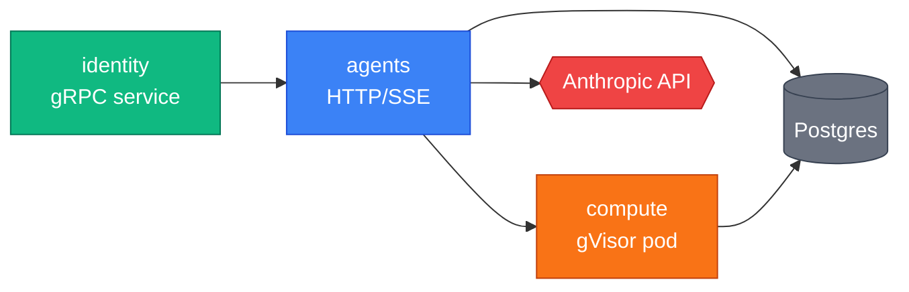

# paperboard Mermaid diagram theme

Canonical color tokens and shape conventions for all diagrams in `paper-board/.github/docs/`
and per-service `docs/`. Copy the `classDef` block verbatim into every Mermaid diagram.
Do not abbreviate, rename, or omit any class.

______________________________________________________________________

## classDef block (copy into every diagram)

```
classDef controlPlane fill:#10b981,stroke:#047857,color:#fff
classDef dataPlane fill:#3b82f6,stroke:#1d4ed8,color:#fff
classDef sandbox fill:#f97316,stroke:#c2410c,color:#fff
classDef external fill:#ef4444,stroke:#b91c1c,color:#fff
classDef persistence fill:#6b7280,stroke:#374151,color:#fff
```

______________________________________________________________________

## Color tokens

| Class name     | Fill      | Stroke    | Semantic role                                      |
| -------------- | --------- | --------- | -------------------------------------------------- |
| `controlPlane` | `#10b981` | `#047857` | gRPC services, schedulers, lifecycle controllers   |
| `dataPlane`    | `#3b82f6` | `#1d4ed8` | HTTP/SSE endpoints, request routing                |
| `sandbox`      | `#f97316` | `#c2410c` | gVisor, per-tenant pods, isolated compute          |
| `external`     | `#ef4444` | `#b91c1c` | LLM API, payment provider, OAuth, external systems |
| `persistence`  | `#6b7280` | `#374151` | Postgres, Redis, PVC, S3, object storage           |

______________________________________________________________________

## Shape conventions

| Mermaid syntax  | Shape        | Use for                       |
| --------------- | ------------ | ----------------------------- |
| `A["label"]`    | Rectangle    | Service, Pod                  |
| `A[("label")]`  | Cylinder     | Database, persistent storage  |
| `A{{"label"}}`  | Hexagon      | External API                  |
| `A("label")`    | Rounded rect | K8s controller, scheduler     |
| `subgraph name` | Subgraph box | Namespace or cluster boundary |

______________________________________________________________________

## Diagram types

| Type            | Mermaid keyword             | Use for                         |
| --------------- | --------------------------- | ------------------------------- |
| System overview | `flowchart LR` / `graph TD` | Service mesh, repo map          |
| Sequence        | `sequenceDiagram`           | Request flow, lifecycle         |
| State machine   | `stateDiagram-v2`           | Sandbox/agent/session lifecycle |
| ER              | `erDiagram`                 | Database schema                 |
| Deployment      | `flowchart TB` + `subgraph` | Helm + K8s topology             |

______________________________________________________________________

## Diagram budget per page

| Page block                   | Expected diagrams                                |
| ---------------------------- | ------------------------------------------------ |
| Overview                     | 1 hero diagram (system or architecture)          |
| Tutorial                     | 1 sequence diagram (the flow being taught)       |
| API Reference                | optional (only if endpoint flow is non-trivial)  |
| Operations                   | 1 deployment diagram or state machine            |
| Architecture (cross-cutting) | 2–3 diagrams (system + sequence + state typical) |

______________________________________________________________________

## Example — colors in use



______________________________________________________________________

## Phase 5 note

S5 (Standards + ADR mirror wave) will wire Starlight's `customCss` to import a shared
`diagram-theme.css` generated from this file. Until then, copy the `classDef` block into
every diagram manually.
