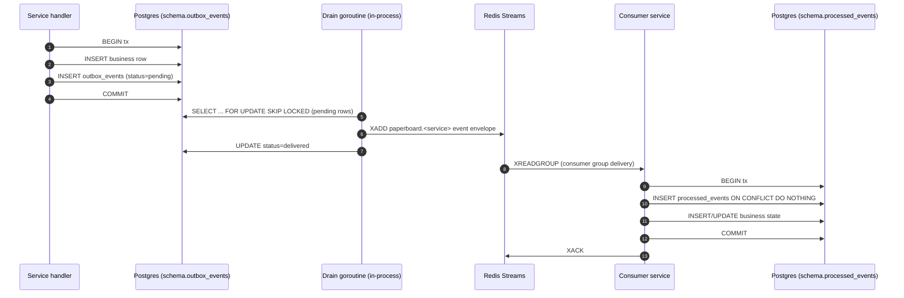

The outbox pattern is the standard mechanism for cross-service event emission in
paper-board from Phase 4 onward. It replaces the Phase 1–3 synchronous gRPC audit
calls with at-least-once async delivery that does not block the critical path.

Decision source: [ADR-0005](../decisions/0005-rest-public-grpc-internal.md) (Phase 4+
async event bus) and Phase 4 brainstorm D6/D9.3/D9.4.

## Why outbox

A naive approach emits an event to Redis inside the same HTTP handler that mutates the
database. If the process crashes between the DB commit and the Redis write, the event is
lost. Wrapping both in a distributed transaction is worse — it couples database uptime to
broker uptime.

The outbox pattern avoids both failure modes:

1. The domain write and the outbox row land in the **same Postgres transaction**. If the
   transaction rolls back, the outbox row disappears with it. If it commits, both are
   durable.
2. A separate in-process drain goroutine reads pending outbox rows and publishes them to
   Redis Streams. The drain is idempotent — a crash and restart simply re-delivers rows
   that were not yet marked delivered.

The result: cross-service events are **guaranteed to be emitted eventually** as long as
the service can reach Postgres, with no dependency on Redis availability during the
business write.

## Schema

Each service that emits events owns an `outbox_events` table inside its own schema
(ADR-0003 cross-schema FK ban; see [service map](./service-map.md) for schema ownership).

```sql
CREATE TABLE <schema>.outbox_events (
    event_id        UUID         PRIMARY KEY DEFAULT gen_random_uuid(),
    event_type      TEXT         NOT NULL,   -- "identity.user.created"
    source_service  TEXT         NOT NULL,   -- "identity"
    schema_version  INT          NOT NULL DEFAULT 1,
    stream          TEXT         NOT NULL,   -- "paperboard.identity"
    payload         JSONB        NOT NULL,   -- protojson-encoded envelope
    trace_id        TEXT,
    org_id          UUID,
    occurred_at     TIMESTAMPTZ  NOT NULL,
    status          TEXT         NOT NULL DEFAULT 'pending',
    attempts        INT          NOT NULL DEFAULT 0,
    last_attempt_at TIMESTAMPTZ,
    last_error      TEXT,
    delivered_at    TIMESTAMPTZ,
    created_at      TIMESTAMPTZ  NOT NULL DEFAULT NOW()
);

-- drain query uses this index: WHERE status = 'pending' ORDER BY occurred_at, event_id
CREATE INDEX outbox_events_pending
    ON <schema>.outbox_events (status, occurred_at, event_id)
    WHERE status = 'pending';
```

The `status` column cycles: `pending` → `delivered` (or `dead` after `MaxAttempts`
exhausted).

## Producer side — sdk/outbox

The `paper-board/sdk/outbox` package ships a `Publisher` interface:

```go
type Publisher interface {
    // Publish writes the outbox row inside the caller's transaction.
    // Must be called inside the same pgx.Tx as the business write.
    Publish(ctx context.Context, tx pgx.Tx, e Event) error

    // Start launches the drain + cleanup goroutines. Call in a goroutine at startup.
    Start(ctx context.Context) error

    // Stop signals drain + cleanup to finish in-flight work (bounded by FlushTimeout).
    Stop(ctx context.Context) error
}
```

The `Event` struct carries:

| Field           | Type        | Notes                                         |
| --------------- | ----------- | --------------------------------------------- |
| `EventID`       | `uuid.UUID` | Dedupe key; auto-stamped if zero.             |
| `EventType`     | `string`    | Dotted convention: `"identity.user.created"`. |
| `Stream`        | `string`    | Redis stream name: `"paperboard.identity"`.   |
| `Payload`       | `[]byte`    | protojson-encoded event payload.              |
| `TraceID`       | `string`    | OpenTelemetry trace id from caller context.   |
| `OrgID`         | `string`    | Tenancy scope; empty only for `user.created`. |
| `SchemaVersion` | `int32`     | Payload schema version; `1` in Wave 1.        |
| `OccurredAt`    | `time.Time` | Service clock, UTC.                           |

Constructing a publisher:

```go
pub, err := outbox.NewPublisher(pool, outbox.Config{
    Schema:        "identity",
    SourceService: "identity",
    Stream:        "paperboard.identity",
    RedisAddr:     "redis-master.paper-board:6379",
})
```

Emitting inside a business transaction:

```go
tx, _ := pool.Begin(ctx)
// ... mutate business tables ...
err = pub.Publish(ctx, tx, outbox.Event{
    EventType:  "identity.user.created",
    Stream:     "paperboard.identity",
    Payload:    payloadBytes,
    TraceID:    traceID,
    OccurredAt: time.Now().UTC(),
})
tx.Commit(ctx)
```

## Migration helper placement

`outbox.NewMigrationHelper(schema)` creates the `outbox_events` table. It must run from
`cmd/migrator` (the Helm `pre-install`/`pre-upgrade` Job), **not** from server boot:

```go
// cmd/migrator/main.go — correct placement
helper := outbox.NewMigrationHelper("identity")
if err := helper(ctx, pool); err != nil {
    log.Fatal(err)
}
```

**Never call the migration helper from `cmd/server/main.go`.** The migrator uses a
direct Postgres connection (`MIGRATION_DB_URL`, port 5432, session mode) that holds the
advisory lock for the migration window. The server uses PgBouncer (`DATABASE_URL`, port
6432, transaction pool mode); running DDL through PgBouncer breaks prepared-statement
state and can deadlock against the migrator's lock.

The advisory lock ID is auto-derived (CRC32 of `database+schema`) by the golang-migrate
pgx/v5 driver; no manual lock-id assignment is needed ([ADR-0017](../decisions/0017-advisory-lock-auto-derivation.md)).

## Consumer side — sdk/inbox

The `paper-board/sdk/inbox` package provides at-least-once deduplication for consumers
reading from Redis Streams ([ADR-0018](../decisions/0018-idempotency-v2-replay-semantics.md)).

```go
ib := inbox.New(pool, "onboarding")

// In the Redis Streams consumer loop:
tx, _ := pool.Begin(ctx)
claimed, err := ib.TryMark(ctx, tx, event.EventID, event.EventType, event.OrgID)
if err != nil { tx.Rollback(ctx); return err }
if !claimed { tx.Rollback(ctx); return nil } // duplicate — skip
// ... apply business state inside the same tx ...
tx.Commit(ctx)
```

`TryMark` inserts into `<schema>.processed_events` with `ON CONFLICT DO NOTHING`. If
the row already exists (duplicate delivery), `claimed=false` is returned and the caller
skips business-state mutations. The claim and the business write commit atomically —
if the service crashes after `tx.Commit`, the event will be redelivered, but `TryMark`
will return `claimed=false` and the duplicate is safely skipped.

The `inbox.NewMigrationHelper` follows the same placement rule as the outbox helper:
call it from `cmd/migrator`.

Processed-events rows are retained for 180 days; cleanup is handled by a per-service
CronJob in each consumer's Helm chart (not by the sdk).

## DLQ and forward-only retry

When a consumer cannot process an event after exhausting its retry budget, it writes a
record to a `dead_letters` table in its own schema and emits an `audit` event. The
`agentctl` CLI exposes operator commands to inspect and replay:

```shell
agentctl onboarding dlq inspect <event_id>
agentctl onboarding dlq replay  <event_id>
```

Replay re-inserts the original event into the consumer's processing pipeline (forward-only
— no compensation or rollback). This design mirrors the outbox drain pattern: a single
path from received event to applied state, with operator-triggered re-entry for poison
messages. (D9.3)

## Two-layer retry semantics

Retry operates at two independent layers (D9.4):

| Layer        | Mechanism                                     | Budget                        | On exhaustion    |
| ------------ | --------------------------------------------- | ----------------------------- | ---------------- |
| Inner (fast) | In-process retry within the consumer handler  | 3 attempts, immediate backoff | promote to outer |
| Outer (slow) | Redis Streams consumer group `delivery_count` | 5 deliveries                  | move to DLQ      |
| Age cap      | —                                             | 1 hour since `OccurredAt`     | instant DLQ      |

A transient error (network blip, DB timeout) is retried at the inner layer. A permanent
error (schema mismatch, missing FK reference) skips the inner retries and moves directly
to the DLQ. The outer layer provides a backstop for consumer crashes between inner
attempts.

The outbox drain side also applies retry: `Config.MaxAttempts` (default 5) with
exponential backoff `[1s, 2s, 4s, 8s, 16s]`. A row that reaches `dead` status on the
drain side (Redis unreachable for all attempts) is a separate concern from consumer-side
DLQ and requires separate operator action.

## Ordering guarantees

The drain goroutine fetches pending rows ordered by `(occurred_at, event_id)` using
`FOR UPDATE SKIP LOCKED`. Within a single drain batch on a single replica, rows are
published to Redis in that order. Redis appends each `XADD` to the stream in arrival
order, so the partial ordering within a batch is preserved.

**No per-aggregate ordering is guaranteed.** Under multiple service replicas or
concurrent drain workers, a later event for the same aggregate can be published before
an earlier event that is still lock-held on another worker. The `outbox_events` schema
has no `aggregate_id` column or per-aggregate sequence counter.

Consumers MUST NOT assume events for a single entity arrive in causal order.
Defensive consumer patterns:

- Use `occurred_at` from the envelope to reject stale events (last-write-wins or
  version-compare).
- Use the inbox idempotency table to detect and skip duplicates.
- Model state as append-only or CRDT where out-of-order delivery is benign.

There is also **no ordering across streams** (`paperboard.identity` vs
`paperboard.agents` are independent streams processed by separate consumer groups).

## Trace propagation

The `TraceID` field on `Event` carries the OpenTelemetry trace ID from the producing
request context. The drain goroutine writes it to `trace_id` in the outbox row; the
Redis envelope includes it verbatim.

On the consumer side, reconstruct the span context from `trace_id` before processing:
this links the consumer span to the original producer span, making the full async flow
visible in the trace backend.

## Flow diagram



## Where to go next

- [Communication patterns](./communication-patterns.md) — the sync-to-async transition
  and the full request-flow diagram.
- [Service map](./service-map.md) — which services emit outbox events and which schemas
  own the tables.
- [ADR-0005](../decisions/0005-rest-public-grpc-internal.md) — decision to adopt Redis
  Streams + outbox for Phase 4 cross-cutting events.
- [ADR-0017](../decisions/0017-advisory-lock-auto-derivation.md) — advisory lock
  auto-derivation (no manual IDs).
- [ADR-0018](../decisions/0018-idempotency-v2-replay-semantics.md) — inbox idempotency
  and replay semantics.
