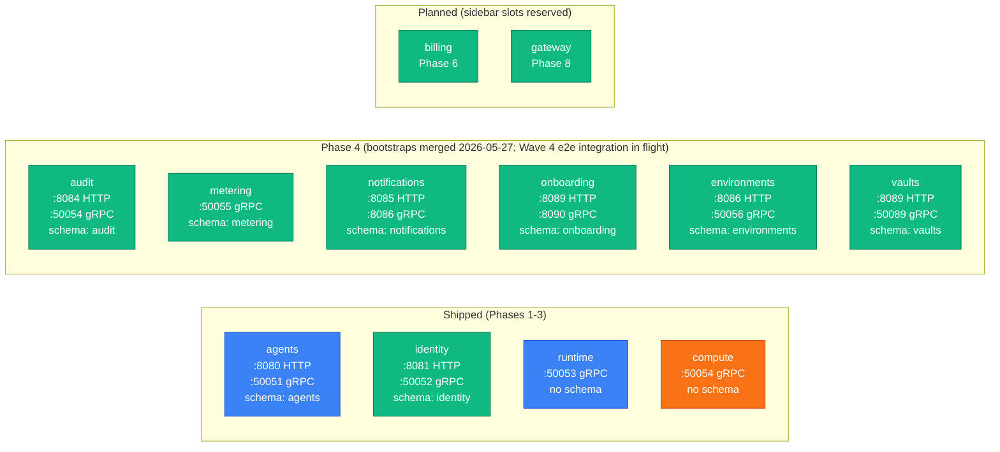

Quick reference for every repo in the `paper-board` org: what port it listens on, which
Postgres schema it owns, and which phase it shipped in.

## Backend services



| Repo                        | HTTP port | gRPC port | Schema          | Phase | Bootstrap status  |
| --------------------------- | --------- | --------- | --------------- | ----- | ----------------- |
| `paper-board/agents`        | 8080      | 50051     | `agents`        | 1.1   | shipped           |
| `paper-board/identity`      | 8081      | 50052     | `identity`      | 2     | shipped           |
| `paper-board/runtime`       | —         | 50053     | none            | 3     | shipped           |
| `paper-board/compute`       | —         | 50054     | none            | 3     | shipped           |
| `paper-board/audit`         | 8084      | 50054     | `audit`         | 4     | merged 2026-05-27 |
| `paper-board/metering`      | —         | 50055     | `metering`      | 4     | merged 2026-05-27 |
| `paper-board/notifications` | 8085      | 8086      | `notifications` | 4     | merged 2026-05-27 |
| `paper-board/onboarding`    | 8089      | 8090      | `onboarding`    | 4     | merged 2026-05-27 |
| `paper-board/environments`  | 8086      | 50056     | `environments`  | 4     | merged 2026-05-27 |
| `paper-board/vaults`        | 8089      | 50089     | `vaults`        | 4     | merged 2026-05-27 |
| `paper-board/billing`       | —         | —         | `billing`       | 6     | planned           |
| `paper-board/gateway`       | 443       | —         | none            | 8     | planned           |

> **Note on Phase-4 default port collisions.** Some Phase-4 services share default ports (`environments` HTTP 8086 vs `notifications` gRPC 8086; `onboarding` HTTP 8089 vs `vaults` HTTP 8089). In Kubernetes this is benign — each service binds inside its own pod and is reached by Service DNS — but in single-host local dev two services on the same default port will collide. Override with `SERVER_PORT` / `GRPC_PORT` env vars when running multiple services side-by-side.

### agents (Phase 1.1)

Agent definitions and versions, sessions, budget reservations, memory collections, and
artifact metadata. The product from the user's perspective. Dispatches to the Anthropic API
for LLM inference; relays the response as an SSE stream to the caller.

- **REST:** `POST /v1/agents`, `POST /v1/agents/{id}/messages` (SSE), `GET /v1/agents/{id}`
- **gRPC:** `agents.v1.AgentsService` (internal callers: runtime, compute)
- **DB user:** `agents_app`
- **GHCR images:** `ghcr.io/paper-board/agents-server`, `ghcr.io/paper-board/agents-migrator`

### identity (Phase 2)

Users, organizations, RBAC, JWT signing, MFA, API keys, refresh-token rotation, invitations,
and idempotency cache. Every other service trusts identity's JWT — no cross-service JWT
re-verification.

- **REST:** `POST /v1/orgs`, `POST /v1/tokens`, `POST /v1/users`, `POST /v1/api-keys`
- **gRPC:** `identity.v1.IdentityService`, `identity.v1.AuthService`
- **DB user:** `identity_app`
- **GHCR images:** `ghcr.io/paper-board/identity-server`, `ghcr.io/paper-board/identity-migrator`

### runtime (Phase 3)

Per-tenant data-plane pod. Stateless — no Postgres schema, no persistent state. Receives
prompts from `agents` via gRPC stream, holds the agent definition in memory for the session,
and dispatches code execution to `compute`.

- **gRPC:** `runtime.v1.RuntimeService` (called by: agents)
- **DB user:** none
- **GHCR images:** `ghcr.io/paper-board/runtime-server`

### compute (Phase 3)

gVisor sandbox host and exec-server. Receives `ExecCommand` calls from `runtime`, executes
code inside an isolated gVisor pod, returns stdout/stderr, writes artifact metadata back to
`agents`, and emits usage events.

- **gRPC:** `compute.v1.ComputeService` — `CreateSandbox`, `ExecCommand`, `DestroySandbox`
- **DB user:** none
- **GHCR images:** `ghcr.io/paper-board/compute-server`

### audit (Phase 4)

Centralized audit-event log. Other services emit events via gRPC; audit persists them, applies
retention rules, and exposes a query API. Phase 5+ adds hash-chain integrity.

- **gRPC:** `audit.v1.AuditService` — `Ingest`, `Query`
- **DB user:** `audit_app`
- **GHCR images:** `ghcr.io/paper-board/audit-server`, `ghcr.io/paper-board/audit-migrator`

### metering (Phase 4)

Consumes raw usage events from `compute` (pod-seconds, tool-calls, workspace-minutes) and
rolls them up to hourly / daily / monthly counters per `(org, sku)`. Provides the invoice
basis read by `billing` from Phase 6.

- **gRPC:** `metering.v1.MeteringService` — `Ingest`, `QueryRollup`
- **DB user:** `metering_app`
- **GHCR images:** `ghcr.io/paper-board/metering-server`, `ghcr.io/paper-board/metering-migrator`

### notifications (Phase 4)

Outbound notification gateway. Phase 4 ships e-mail (SMTP-backed); in-app + push channels
land in Phase 6+. Other services emit `notification.requested` events; notifications routes
them by user preferences.

- **REST:** `POST /v1/notifications` (internal admin)
- **gRPC:** `notifications.v1.NotificationsService`
- **DB user:** `notifications_app`
- **GHCR images:** `ghcr.io/paper-board/notifications-server`, `ghcr.io/paper-board/notifications-migrator`

### onboarding (Phase 4)

Cross-service orchestrator. Consumes `identity.user.created` outbox events and seeds the new
user with a default organization, a sample "Coding Assistant" agent, and a starter
`environment` + `vault`. Idempotent and replayable.

- **gRPC:** `onboarding.v1.OnboardingService`
- **DB user:** `onboarding_app`
- **GHCR images:** `ghcr.io/paper-board/onboarding-server`, `ghcr.io/paper-board/onboarding-migrator`

### environments (Phase 4)

Container configuration domain object — packages, networking rules, non-sensitive
`KEY=VALUE` env vars. Modeled on the Anthropic Managed Agents Environment pattern. Each
agent session reads exactly one `environment_id`.

- **REST:** `POST /v1/environments`, `GET /v1/environments/{id}`
- **gRPC:** `environments.v1.EnvironmentsService`
- **DB user:** `environments_app`
- **GHCR images:** `ghcr.io/paper-board/environments-server`, `ghcr.io/paper-board/environments-migrator`

### vaults (Phase 4)

Encrypted credentials store — Anthropic API key, future LLM provider keys, OAuth tokens.
GCP KMS envelope encryption. Modeled on the Anthropic Managed Agents Vault pattern. Sessions
reference vault entries by `vault_id`; raw secrets never leave the service.

- **REST:** `POST /v1/vaults`, `POST /v1/vaults/{id}/entries`
- **gRPC:** `vaults.v1.VaultsService` (internal callers: runtime, compute via session bootstrap)
- **DB user:** `vaults_app`
- **GHCR images:** `ghcr.io/paper-board/vaults-server`, `ghcr.io/paper-board/vaults-migrator`

### billing (Phase 6 — planned)

Subscriptions, pricing rates (3-level cascade), bill rendering, marketplace listings and
payouts, promo code redemption. Multi-provider Payment abstraction from Day 1: Stripe,
iyzico, PayTR, Param. Reads the metering rollups from Phase 4 onward.

- **DB user:** `billing_app`
- **GHCR images:** `ghcr.io/paper-board/billing-server`, `ghcr.io/paper-board/billing-migrator`

### gateway (Phase 8 — planned)

Public API entry point. Centralizes JWT verification (fetches JWKS from `identity`), rate
limiting (Redis), idempotency middleware, and routing. Stateless; no Postgres schema.
Phases 1–7 handle auth per-service; Phase 8 moves it here. Deferred so the auth contracts
stabilize first.

- **GHCR images:** `ghcr.io/paper-board/gateway-server`

## Supporting repos

| Repo                           | Purpose                                                              | License     | Status            |
| ------------------------------ | -------------------------------------------------------------------- | ----------- | ----------------- |
| `paper-board/sdk`              | Shared Go library (log, obs, auth, migrator, outbox)                 | MIT         | shipped           |
| `paper-board/proto`            | gRPC `.proto` + OpenAPI source of truth                              | MIT         | shipped           |
| `paper-board/infra`            | Helm umbrella + subcharts + Terraform                                | Proprietary | shipped           |
| `paper-board/cli`              | `agentctl` ops + admin CLI (ops / dlq / rollup / reconcile)          | MIT         | Phase 4 scaffold  |
| `paper-board/service-template` | Skeleton for new backend services; run `SVC=… ./init.sh` after clone | MIT         | shipped           |
| `paper-board/.github`          | Org community files + this docs site                                 | MIT         | shipped           |
| `paper-board/e2e`              | Cross-service e2e test suite (PB-85)                                 | Proprietary | planned (Phase 4) |
| `paper-board/website`          | Marketing site (paperboard.app)                                      | Proprietary | planned (Phase 5) |
| `paper-board/dashboard`        | Customer dashboard (dashboard.paperboard.app)                        | Proprietary | planned (Phase 5) |

The earlier `paper-board/frontend` plan was superseded by the `website` + `dashboard` split
in the Phase-4 brainstorm (see [ADR-0016](../decisions/0016-phase-4-mvp0-substrate-resequence.md)).

## Database ownership

Single Postgres cluster; each service owns exactly one schema. Cross-schema foreign keys
are forbidden (ADR-0003) — services reference each other by UUID without FK constraints.

| Schema          | Owner service              | DB user             |
| --------------- | -------------------------- | ------------------- |
| `agents`        | agents                     | `agents_app`        |
| `identity`      | identity                   | `identity_app`      |
| `audit`         | audit                      | `audit_app`         |
| `metering`      | metering                   | `metering_app`      |
| `notifications` | notifications              | `notifications_app` |
| `onboarding`    | onboarding                 | `onboarding_app`    |
| `environments`  | environments               | `environments_app`  |
| `vaults`        | vaults                     | `vaults_app`        |
| `billing`       | billing (planned, Phase 6) | `billing_app`       |

Services with no schema (`runtime`, `compute`, `gateway`) have no DB user and no migrator.

> **Advisory locks** are auto-derived: `paper-board/sdk/migrator` uses golang-migrate's pgx/v5 driver, which computes a CRC32 lock id from `database+schema`. Schema-per-service (ADR-0002) guarantees hash isolation — no manual lock-id numbering needed. Earlier revisions of this page enumerated per-service lock ids (`identity=1, agents=3, …`); that table was fiction and has been removed.

## Kubernetes service DNS

Internal gRPC calls use Kubernetes Service DNS:

```
<service>.paper-board.svc.cluster.local:<grpc-port>
```

Examples:

- `identity.paper-board.svc.cluster.local:50052`
- `agents.paper-board.svc.cluster.local:50051`
- `compute.paper-board.svc.cluster.local:50054`
- `audit.paper-board.svc.cluster.local:50054`
- `metering.paper-board.svc.cluster.local:50055`
- `vaults.paper-board.svc.cluster.local:50089`

Client-side load balancing replaces DNS-based discovery in Phase 6+.

## GHCR image naming

```
ghcr.io/paper-board/<service>-<binary>:<semver-tag>
```

Every service ships two images: a `server` image and (for services with a schema) a
`migrator` image. The migrator image runs as the Helm `pre-install` / `pre-upgrade` Job
(ADR-0004).

## Where to go next

- [Communication patterns](./communication-patterns.md) — REST vs gRPC, sync vs async, outbox.
- [Data plane vs control plane](./data-plane-control-plane.md) — runtime / compute roles.
- [ADR-0015 phase rebalance](../decisions/0015-mvp-launch-phase-rebalance.md).
- [ADR-0016 Phase 4 substrate resequence](../decisions/0016-phase-4-mvp0-substrate-resequence.md).
