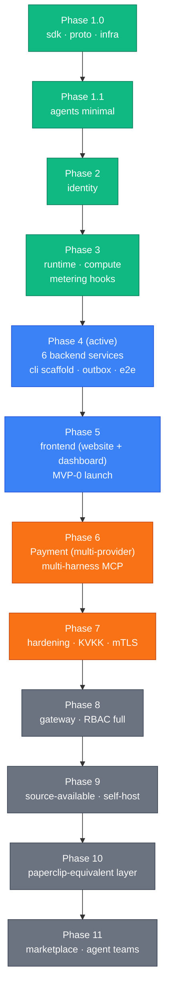

paperboard is a multi-repo microservices platform. We chose this structure deliberately:
each service owns its schema, its release lifecycle, and its scaling profile independently.
The coupling between services is explicit (gRPC contracts in `paper-board/proto`) rather
than implicit (shared database tables). This made early phases faster to ship and will make
the Phase 7 hardening pass tractable.

## Hero diagram — current org state

20 GitHub repos are planned under `paper-board`; 16 are bootstrapped as of 2026-05-27.
Planned-but-not-yet-bootstrapped repos are drawn dashed.

```mermaid
flowchart LR
  subgraph ext["External"]
    client{{"Browser / CLI / MCP"}}
    anthropic{{"Anthropic API"}}
    s3{{"S3"}}
    payment{{"Payment provider"}}
  end

  subgraph control["Control plane"]
    gateway["gateway<br/>Phase 8 (planned)"]:::dashed
    identity["identity<br/>Phase 2"]
    billing["billing<br/>Phase 6 (planned)"]:::dashed
    audit["audit<br/>Phase 4"]
    metering["metering<br/>Phase 4"]
    notifications["notifications<br/>Phase 4"]
    onboarding["onboarding<br/>Phase 4"]
    environments["environments<br/>Phase 4"]
    vaults["vaults<br/>Phase 4"]
  end

  subgraph data["Data plane"]
    agents["agents<br/>Phase 1.1"]
    runtime["runtime<br/>Phase 3"]
  end

  subgraph sandbox["Sandbox tier"]
    compute["compute<br/>Phase 3"]
  end

  subgraph support["Supporting"]
    sdk[("sdk")]
    proto[("proto")]
    infra[("infra")]
    cli[("cli")]
    serviceTemplate[("service-template")]
    e2e[("e2e<br/>Phase 4 PB-85"):::dashed]
    website[("website<br/>Phase 5"):::dashed]
    dashboard[("dashboard<br/>Phase 5"):::dashed]
  end

  subgraph storage["Persistence"]
    pg[("Postgres<br/>schema-per-service")]
    redis[("Redis<br/>Phase 4+ outbox")]
    pvc[("PVC / S3<br/>workspace")]
    kms[("GCP KMS<br/>vault envelope")]
  end

  client --> gateway
  client -.-> identity
  client -.-> agents
  gateway --> identity
  gateway --> agents
  gateway --> billing
  agents --> runtime
  agents --> anthropic
  runtime --> compute
  compute --> s3
  compute --> pvc
  compute --> metering
  agents --> pg
  identity --> pg
  billing -.-> pg
  audit --> pg
  metering --> pg
  notifications --> pg
  onboarding --> pg
  environments --> pg
  vaults --> pg
  audit --> redis
  metering --> redis
  notifications --> redis
  onboarding --> redis
  vaults --> kms
  billing -.-> payment

  classDef controlPlane fill:#10b981,stroke:#047857,color:#fff
  classDef dataPlane fill:#3b82f6,stroke:#1d4ed8,color:#fff
  classDef sandbox fill:#f97316,stroke:#c2410c,color:#fff
  classDef external fill:#ef4444,stroke:#b91c1c,color:#fff
  classDef persistence fill:#6b7280,stroke:#374151,color:#fff
  classDef dashed stroke-dasharray:5 3,opacity:0.7

  class gateway,identity,billing,audit,metering,notifications,onboarding,environments,vaults controlPlane
  class agents,runtime dataPlane
  class compute sandbox
  class client,anthropic,s3,payment external
  class pg,redis,pvc,kms,sdk,proto,infra,cli,serviceTemplate,e2e,website,dashboard persistence
```

The color coding carries semantic meaning throughout all paperboard diagrams:

| Color  | Role          | Services                                                                                         |
| ------ | ------------- | ------------------------------------------------------------------------------------------------ |
| Green  | Control plane | gateway, identity, billing, audit, metering, notifications, onboarding, environments, vaults     |
| Blue   | Data plane    | agents, runtime                                                                                  |
| Orange | Sandbox tier  | compute (gVisor boundary)                                                                        |
| Red    | External      | Anthropic API, payment providers, S3, clients                                                    |
| Gray   | Persistence   | Postgres, Redis, PVC, GCP KMS, sdk, proto, infra, cli, service-template, e2e, website, dashboard |

Dashed outline = repo planned but not yet bootstrapped.

## High-level components

### Control plane

The control plane services own configuration, identity, billing state, and orchestration.
They are stateful (each owns a Postgres schema) and change infrequently relative to the data
plane.

**identity** (Phase 2) manages who is allowed to do what. It owns user accounts,
organizations (tenants), RBAC roles, JWT signing keys, MFA, API keys, and invitation flows.
Every other service trusts identity's JWT claims; they do not re-verify signatures.

**audit** (Phase 4) is the centralized event log. Other services emit audit events via gRPC;
audit persists them with retention rules and exposes a query API. Hash-chain integrity lands
in Phase 7+.

**metering** (Phase 4) rolls up raw usage events emitted by `compute` (pod-seconds,
tool-calls, workspace-minutes) into hourly / daily / monthly counters per `(org, sku)`.
Provides the invoice basis read by `billing` starting Phase 6.

**notifications** (Phase 4) is the outbound notification gateway. Phase 4 ships e-mail
(SMTP-backed); in-app + push channels land in Phase 6+. Other services emit
`notification.requested` events via the outbox; notifications routes them by user preferences.

**onboarding** (Phase 4) is a cross-service orchestrator. It consumes `identity.user.created`
outbox events and seeds the new user with a default organization, a sample "Coding Assistant"
agent, and a starter `environment` + `vault`. Idempotent and replayable.

**environments** (Phase 4) owns container configuration domain objects — packages, networking
rules, non-sensitive `KEY=VALUE` env vars. Modeled on the Anthropic Managed Agents
Environment pattern (see [ADR-0016](../decisions/0016-phase-4-mvp0-substrate-resequence.md)).
Each agent session reads exactly one `environment_id`.

**vaults** (Phase 4) is the encrypted credentials store — Anthropic API keys, future LLM
provider keys, OAuth tokens. GCP KMS envelope encryption. Modeled on the Anthropic Managed
Agents Vault pattern. Sessions reference vault entries by id; raw secrets never leave the
service.

**billing** (Phase 6, planned) will own subscriptions, pricing rates, and the payment
abstraction layer. We chose to keep billing as a single cohesive context rather than split
it into separate subscription-service and payment-service because the coupling between
pricing rules and provider state is tight enough that splitting would create more
coordination overhead than it saves.

**gateway** (Phase 8, planned) will be the public API entry point. It will centralize JWT
verification, rate limiting (Redis), and idempotency middleware. Phases 1–7 handle auth
per-service; Phase 8 moves it here. We deferred gateway because centralization before the
auth contracts stabilize creates churn.

### Data plane

**agents** (Phase 1.1) is the product itself from the user's perspective. It owns agent
definitions and versions, sessions (the event store), budget reservations, memory collections
(pgvector in Phase 4+), and artifact metadata. When a user sends a message, `agents` receives
it, dispatches to the Anthropic API for LLM inference, and streams the response back via SSE.

**runtime** (Phase 3) is the per-tenant execution pod. It is stateless — it holds no
persistent state of its own. Its role is to receive a prompt from `agents`, fetch the agent
definition, and dispatch the actual code execution down to `compute`. One runtime pod per
`(org_id, image_digest)` tuple at steady state.

### Sandbox tier

**compute** (Phase 3) runs code in gVisor-isolated pods. It is the security boundary:
anything a user's agent does that touches the file system or network happens inside a gVisor
sandbox. After execution, compute emits usage events (pod-seconds, tool-calls,
workspace-minutes) and flushes workspace state to S3 via the workspace bridge sidecar.

### Supporting repos

**sdk** (`paper-board/sdk`) is the shared Go library. It ships `log`, `obs` (OTel),
`auth/middleware`, `migrator`, `outbox` (Phase 4+), and shared `errors`. MIT-licensed
(open core) and SemVer-disciplined.

**proto** (`paper-board/proto`) is the single source of truth for all gRPC and HTTP contracts.
`buf generate` produces Go + TypeScript clients. Consuming services bump the proto dependency
to pick up contract changes.

**infra** (`paper-board/infra`) holds the Helm umbrella chart, per-service subcharts,
Terraform, and Kubernetes manifests. The Helm chart version mirrors the service version.

**cli** (`paper-board/cli`, Phase 4 scaffold) is the ops + admin CLI. Phase-4 surface area:
DLQ inspect / requeue, metering rollup forward, cross-service reconcile. The customer-facing
`agentctl` is a later concern.

**service-template** (`paper-board/service-template`) is the skeleton every new backend service
clones from. Run `SVC=<name> ./init.sh` after clone to substitute placeholders.

**e2e** (`paper-board/e2e`, planned, Phase 4 PB-85) will host the cross-service automated
e2e test suite. Wave-4 deliverable; bootstrap PR pending.

**website** + **dashboard** (planned, Phase 5) replace the earlier single `frontend` repo
plan. `website` is the marketing site at `paperboard.app`; `dashboard` is the customer
dashboard at `dashboard.paperboard.app`. The split keeps marketing-team workflow distinct
from product-engineering churn.

## Phase ladder

We build in vertical slices per [ADR-0006](../decisions/0006-vertical-implementation.md).
The current ordering reflects [ADR-0015](../decisions/0015-mvp-launch-phase-rebalance.md)
and the Phase-4 substrate split in
[ADR-0016](../decisions/0016-phase-4-mvp0-substrate-resequence.md).



Phase 4 (active) is the backend substrate phase: six new services, the outbox SDK pattern,
the cli scaffold, and the e2e test suite. Phase 4 is **not** the MVP-0 launch — that
milestone now lives at the end of Phase 5 (frontend), per ADR-0016.

## Design decisions

The major cross-cutting decisions are recorded as ADRs:

| ADR  | Decision                                                      |
| ---- | ------------------------------------------------------------- |
| 0001 | Multi-repo microservices topology                             |
| 0002 | Schema-per-service in a single Postgres cluster               |
| 0003 | No cross-schema foreign keys (UUID-by-reference)              |
| 0004 | Migrator as a shared SDK library + per-service binary         |
| 0005 | REST public + gRPC internal communication                     |
| 0006 | Vertical (tracer-bullet) implementation                       |
| 0014 | MVP-first sequencing (supersedes ADR-0009)                    |
| 0015 | MVP launch phase rebalance (amends ADR-0014)                  |
| 0016 | Phase 4 backend MVP-0 substrate re-sequence (amends ADR-0015) |

See the full [Decisions index](../decisions/) for all ADRs.

## Where to go next

- [Service map](./service-map.md) — port, schema, and phase per service.
- [Communication patterns](./communication-patterns.md) — REST vs gRPC, sync vs async, outbox.
- [Data plane vs control plane](./data-plane-control-plane.md) — the split explained.
