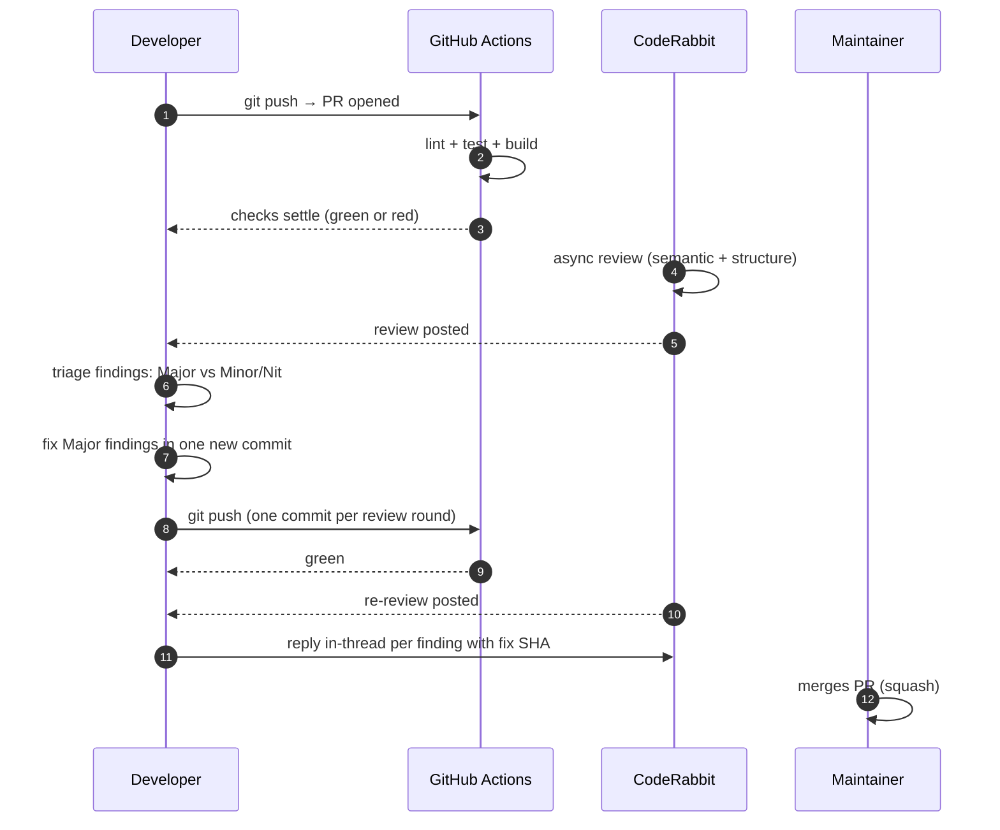

Every change to a paper-board service repo goes through a pull request. We use trunk-based
development: short-lived feature branches off `main`, squash-merged after CI and CodeRabbit
pass. This page covers the full loop from branch creation to merge.

## Branch naming

```
<type>/<short-slug>
```

Types mirror Conventional Commits: `feat`, `fix`, `chore`, `docs`, `refactor`, `test`.

Examples:

```sh
git checkout -b feat/add-session-timeout
git checkout -b fix/migrator-advisory-lock
git checkout -b docs/agents-api-reference
```

Keep slugs lowercase, hyphen-separated, under 40 characters.

**Exception:** `paper-board/agent-manager` (the coordination repo) allows direct push to
`main`. All other repos require PRs.

## Conventional Commits

Every commit message must follow [Conventional Commits](https://www.conventionalcommits.org/):

```
<type>(<scope>): <description>

[optional body]

[optional footer: Co-Authored-By, Closes #N]
```

The `commitlint` pre-commit hook rejects messages that do not conform. Common types:

| Type       | When to use                              |
| ---------- | ---------------------------------------- |
| `feat`     | New feature or behavior                  |
| `fix`      | Bug fix                                  |
| `chore`    | Maintenance (deps, config, CI)           |
| `docs`     | Documentation only                       |
| `refactor` | Code restructure with no behavior change |
| `test`     | Test additions or changes                |
| `perf`     | Performance improvement                  |

Breaking changes: add `!` after the type (`feat!:`) and include a `BREAKING CHANGE:` footer.

## Opening a PR

```sh
gh pr create --title "feat(agents): add session timeout" \
  --body "Closes #42\n\nAdds configurable idle timeout to agent sessions."
```

Reference the Jira Story key or GitHub issue in the body. The `Closes #N` token auto-links
the PR to the issue and transitions the Jira Story to In Review when the PR opens.

## The review loop



### Step 1 — Wait for CI

Poll until all checks settle:

```sh
gh pr checks <PR-number>
```

On failure: read the log, fix the root cause, push a new commit. Never use `--no-verify`
to bypass pre-commit hooks. Never force-push.

### Step 2 — Wait for CodeRabbit

CodeRabbit posts a structured review asynchronously. Use the dual-signal pattern to detect
when it has finished:

```sh
# Signal 1: check the status rollup
gh pr view <PR-number> --json statusCheckRollup \
  | jq '.statusCheckRollup[] | select(.context == "CodeRabbit")'

# Signal 2: check the reviews API (CR may post review before flipping the check)
gh api repos/paper-board/<repo>/pulls/<PR-number>/reviews \
  | jq '.[] | select(.user.login == "coderabbitai[bot]")'
```

Wait until both signals show the review is complete. CR posts an issue-comment of
"No actionable comments" when it finds nothing major.

### Step 3 — Triage findings

CodeRabbit tags each finding as **potential issue**, **nitpick**, or informational.

| Tag               | Action                                             |
| ----------------- | -------------------------------------------------- |
| `potential_issue` | Must fix before merge                              |
| `nitpick`         | May defer — reply in-thread with a one-line reason |
| Informational     | No action required                                 |

Treat any finding tagged `potential_issue` as a **Major** finding — fix it.

### Step 4 — Fix and reply

Fix all Major findings in a single new commit (one commit per review round, not one per
finding). Then reply to each finding **in-thread** (not at top-level):

```
@coderabbitai addressed in <SHA> — <short explanation>
```

Note: the mention is `@coderabbitai` (not `@coderabbitai[bot]`). The bot handle and the
mention handle are different. For Greptile findings, use `@greptileai`.

### Step 5 — Merge

The maintainer (not you) merges via squash merge. Do not run `gh pr merge` yourself unless
explicitly authorized.

After merge, the Jira Story auto-transitions to Done and the branch is deleted.

## Hard rules

These are never negotiable:

- No `git push --force` or `git push --force-with-lease`.
- No `git commit --no-verify` or `git push --no-verify`.
- No `gh pr merge` unless explicitly authorized.
- One commit per review round — do not squash previous rounds into history.
- Never amend a commit that has been pushed to a PR branch.

## Common failure modes

**commitlint rejects your message:** the most common cause is a missing scope or wrong type.
Check `commitlint.config.js` in the repo root for the allowed scopes.

**CI fails on `golangci-lint`:** run `golangci-lint run ./...` locally and fix the reported
issues before pushing.

**markdownlint fails:** run `markdownlint '**/*.md'` locally. The most common issues are
trailing spaces, missing blank lines around headings, and bare triple-backtick code blocks
(always add a language hint).

**CodeRabbit review is stuck on PENDING:** wait up to 5 minutes; CR is eventually consistent.
If it is still PENDING after 10 minutes, check the `statusCheckRollup` via the reviews API
(Signal 2 above) — CR sometimes posts the review body before flipping the check status.

## Next steps

- [Glossary](./glossary.md) — precise definitions for every paperboard term.
- [System overview](../architecture/system-overview.md) — understand the service topology before
  opening your first feature PR.
