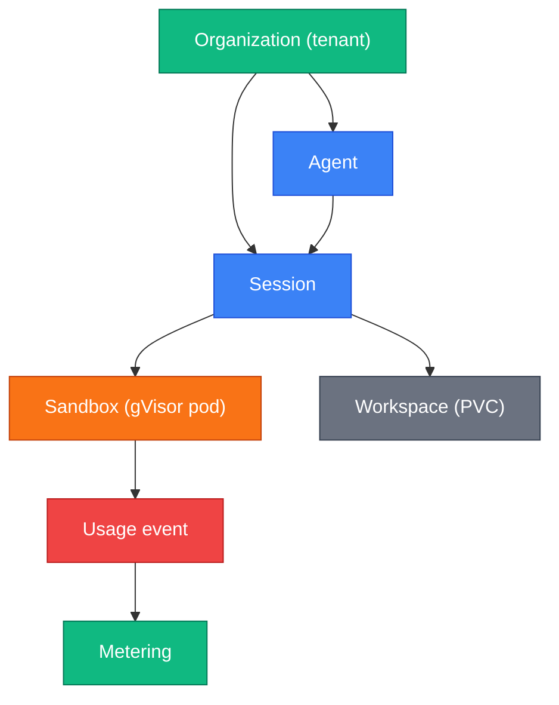

Precise terminology matters when every word in a design doc or ADR is load-bearing. Use
these definitions when writing code, docs, ADRs, or Jira Stories. Where a term has a common
industry meaning that differs from our usage, the difference is called out.

## A

**Advisory lock** — a PostgreSQL session-level lock acquired by the migrator before applying
migrations. Because PgBouncer in transaction-pool mode releases session state between
statements, advisory locks require a direct Postgres connection (`MIGRATION_DB_URL`,
port 5432). `paper-board/sdk/migrator` delegates to golang-migrate's pgx/v5 driver, which
derives the lock id automatically as `CRC32(database+schema)`. Schema-per-service (ADR-0002)
guarantees hash isolation across services, so two services can run their migrators in
parallel without coordination — no manual lock-id numbering needed.

**Agent** — the core product entity. An agent definition (stored in the `agents` schema)
describes a name, system prompt, tool configuration, and LLM model. Agents are versioned;
a session always runs against a specific agent version. Avoid: "agent-service", "bot",
"assistant" as synonyms for this specific domain object.

**Artifact** — a file produced by a sandbox execution session. Metadata (path, size,
content-type, S3 key) is stored in the `agents` schema; the blob lives in S3. The `compute`
service writes artifact metadata back to `agents` via gRPC after each execution.

**Astro Starlight** — the static-site generator used for this documentation portal. Renders
Markdown + Mermaid diagrams and produces a Pagefind search index. Deployed to Cloudflare
Pages.

**Audit service** (`paper-board/audit`) — the centralized audit-event log. Other services
emit events via gRPC; audit persists them with retention rules and exposes a query API.
Phase 7+ adds hash-chain integrity. Schema: `audit`. Avoid: "log-service" as a synonym
(audit's contract is structured events + retention, not free-text log lines).

## B

**BYO API key (BYO key)** — "Bring Your Own API Key". Customers supply their own
`ANTHROPIC_API_KEY`; paperboard does not proxy or mark up LLM tokens. paperboard bills for
compute, not for tokens. This is a conscious product decision (see ADR-0015 D14).

**Budget reservation** — a hold placed against an organization's billing balance before a
session starts. If the reservation fails (balance insufficient), the session is rejected
before any compute is provisioned. Stored in the `agents` schema; settled by the billing
engine after session close.

## C

**Cloudflare Access** — the Zero Trust SSO gate in front of `docs.paperboard.app`. Uses
Google IdP with email-domain restriction (`@kovankaya.com`) plus a per-email guest whitelist
for external collaborators. No VPN required.

**Compute service** (`paper-board/compute`) — the gVisor sandbox host. Receives gRPC streams
from `runtime`, executes code inside an isolated pod, and returns stdout/stderr. Stateless
at the Kubernetes level; workspace state is flushed to an S3-backed Persistent Volume Claim
(PVC) between sessions.

**Conventional Commits** — the commit message format enforced by `commitlint` in every
paper-board service repo. Format: `<type>(<scope>): <description>`. Breaking changes use
`feat!:` with a `BREAKING CHANGE:` footer. See [First PR](./first-pr.md).

**Control plane** — services that own configuration, identity, billing state, and
orchestration: `identity`, `platform`, `billing`, `gateway`. Represented in diagrams with
green (`#10b981`).

## D

**Data plane** — services that handle live request execution: `agents`, `runtime`, `compute`.
Represented in diagrams with blue (`#3b82f6`) for `agents`/`runtime` and orange (`#f97316`)
for `compute` (sandbox boundary).

**DATABASE_URL** — the connection string pointing to PgBouncer on port 6432 (transaction
pool mode). Used by service runtime processes. Never use `DATABASE_URL` in the migrator —
advisory locks do not survive transaction-pool boundary crossings.

## E

**Environment (config object)** — a domain object owned by the `environments` service that
captures container configuration: packages, networking rules, and non-sensitive
`KEY=VALUE` env vars. Each agent session reads exactly one `environment_id`. Modeled on
Anthropic's Managed Agents Environment pattern. **Not** the same as an environment variable
(those live inside an Environment) and **not** the same as a deployment environment
(`dev`/`staging`/`prod`).

**Environments service** (`paper-board/environments`) — the service that owns
`Environment` domain objects. Phase 4. REST + gRPC. Schema: `environments`. Pairs with
[Vault](#v) for the encrypted-credentials half of session config.

**Exec-server** — the binary inside the `compute` pod that receives `ExecCommand` gRPC
calls and runs them inside the gVisor sandbox. Exposes a single gRPC service
(`compute.v1.ComputeService`) internally. Not exposed outside the cluster.

## G

**Gateway service** (`paper-board/gateway`) — the public API entry point (Phase 7). Verifies
JWT (fetches JWKS from identity), enforces rate limits via Redis, runs idempotency
middleware, and routes requests to downstream services. Stateless. In Phases 1–6, auth
verification is per-service; Phase 7 centralizes it here.

**golangci-lint** — the Go linter suite used across all paper-board service repos. Run by the
pre-commit hook and by CI. Configuration lives in `.golangci.yaml` in each repo.

**gVisor** — a user-space kernel (Google open-source) that intercepts system calls from
container processes and handles them in a sandboxed runtime. We use it to isolate tenant
code execution in the `compute` service. Each tenant session gets its own gVisor pod.
Avoid: "container isolation" as a synonym — gVisor is specifically a syscall-intercepting
sandbox, stronger than standard container namespacing.

## H

**Helm pre-install / pre-upgrade Job** — the Kubernetes Job that runs the migrator binary
before a Helm install or upgrade. Defined in each service's Helm chart with the
`helm.sh/hook: pre-install,pre-upgrade` annotation. Ensures migrations always run before
the new service version starts.

## I

**Idempotency cache** — a short-lived record keyed on `(user_id, idempotency_key)` stored
in the `identity` schema. The gateway (or per-service in Phases 1–2) checks this before
processing a mutating request; if a matching key exists, it returns the stored response
without re-executing the handler. Prevents duplicate charges and duplicate agent creates
on network retries.

**Identity service** (`paper-board/identity`) — owns users, organizations (tenants), teams,
RBAC roles, JWT signing keys, MFA, API keys, refresh-token rotation, and invitations.
Schema: `identity`. Avoid: "auth-service", "user-service", "tenant-service" as synonyms.

## J

**JWT** — JSON Web Token. Signed by the `identity` service using an HMAC key
(`JWT_SIGNING_KEY`). Carries claims: `sub` (user ID), `org` (org ID), `roles`. Downstream
services receive the decoded claims via gRPC metadata headers (`x-user-id`, `x-org-id`,
`x-roles`); they do not re-verify the JWT signature.

## M

**Metering** — the process of recording usage events (pod-seconds, tool-call counts,
workspace-minutes, network egress) emitted by `compute` and rolled up by the `metering`
service (Phase 4+) into hourly / daily / monthly counters per `(org, sku)`. The `billing`
engine reads those rollups starting Phase 6. Metering is Phase 3 scope because retroactive
measurement is impossible — events must be emitted from Day 1 or revenue is lost.

**Metering service** (`paper-board/metering`) — the service that consumes raw usage events
and produces invoice-grade rollups. Phase 4. gRPC. Schema: `metering`. Avoid: "billing"
as a synonym (billing reads metering's rollups; the two are separate services).

**MIGRATION_DB_URL** — the connection string pointing to Postgres directly on port 5432
(not PgBouncer). Used exclusively by the migrator binary. Required for advisory locks.

**migrator** — the binary in each service's `cmd/migrator/` that applies forward migrations
to the service's Postgres schema. A ~30-line shim that calls `paper-board/sdk/migrator`.
Subcommands: `up [--dry-run]`, `down N`, `force VERSION`, `version`, `drop` (dev-only,
requires `MIGRATOR_ENV=dev`).

**Mock sub-package** — every `internal/<adapter>/` directory must include a `mock/`
sub-package alongside the production implementation (e.g. `internal/llm/{anthropic,mock}`).
This keeps the adapter-deletion smoke test always-on: `make test-mock-only` swaps every
adapter to `mock` and asserts no non-mock impl is reached at runtime.

**mTLS** — mutual TLS between services. Activated in Phase 7 via cert-manager (per ADR-0015
post-rebalance). Phases 1–6 use NetworkPolicy default-deny instead.

## N

**Notifications service** (`paper-board/notifications`) — the outbound notification gateway.
Phase 4 ships e-mail (SMTP-backed); in-app + push channels land in Phase 6+. Other services
emit `notification.requested` events via the outbox; notifications routes them by user
preferences. Schema: `notifications`. Avoid: "email-service" as a synonym (the contract
is channel-agnostic; email is one transport).

## O

**Onboarding service** (`paper-board/onboarding`) — the cross-service orchestrator that
consumes `identity.user.created` outbox events and seeds the new user with a default
organization, a sample "Coding Assistant" agent, and a starter [Environment](#e) +
[Vault](#v). Idempotent and replayable. Phase 4. Schema: `onboarding`. Avoid: "user-service"
as a synonym (user/org CRUD lives in `identity`; onboarding is the choreographer).

**Organization (org, tenant)** — the top-level billing and isolation unit. Every agent,
session, and workspace belongs to an org. "Tenant" and "org" are synonyms in paperboard;
the database column name is `org_id`. Avoid: "customer" as a domain term in code (use "org").

**Outbox pattern** — the cross-service consistency mechanism replacing cross-schema foreign
keys (forbidden by ADR-0003). A service writes its domain row and an outbox row in the same
transaction; an async dispatcher reads the outbox and publishes to Redis Streams; consumer
services apply with at-least-once semantics and idempotency. Active from Phase 4+. Phases
1–3 use sync gRPC instead.

## P

**paperboard** (one word) — the brand name and product. Used in marketing copy, URLs,
Confluence pages, Jira labels, and user-facing text.

**paper-board** (hyphenated) — the GitHub org name, Go module path prefix, and Helm chart
namespace. Used in repo paths (`github.com/paper-board/agents`), GHCR image names
(`ghcr.io/paper-board/agents-server:v0.1.0`), and Kubernetes namespace
(`paper-board`). The hyphen exists because `paperboard` was already taken on GitHub.

**Pagefind** — the client-side search index shipped with Astro Starlight. Builds a static
JS search index at deploy time; no search server required.

**PgBouncer** — the connection pooler sitting in front of Postgres on port 6432, configured
in transaction-pool mode. Services connect via `DATABASE_URL` (port 6432). The migrator
must never connect via PgBouncer because advisory locks require session-mode connections.

**Phase** — a vertical implementation slice of the paperboard platform, each shipping a
demoable increment. Phases are numbered 1.0 through 10; ordering is set by ADR-0015. From
Phase 4, each phase is a sellable milestone.

**Platform service** — **deprecated term.** The original Phase-4 plan bundled audit +
metering + notifications + onboarding into a single `paper-board/platform` service. The D5a
decision (2026-05-25; see [ADR-0016](../decisions/0016-phase-4-mvp0-substrate-resequence.md))
split it into four independent services. The `platform` repo was never bootstrapped. Use
`audit` / `metering` / `notifications` / `onboarding` explicitly; do not reintroduce the
"platform" label in new code or docs.

**PoLP (Principle of Least Privilege)** — each service's database user (`agents_app`,
`identity_app`, etc.) has USAGE on its own schema only and ALL PRIVILEGES on its own tables.
Cross-schema access is rejected at the Postgres permission level.

**proto** (`paper-board/proto`) — the repository holding all `.proto` files and
OpenAPI specs. Source of truth for all inter-service contracts. `buf generate` produces Go
and TypeScript client code. Versioning is carried in the package name
(`identity.v1`, `identity.v2`).

## R

**RuntimeClass** — the Kubernetes `RuntimeClass` object that routes pod scheduling to the
gVisor runtime handler (`runsc`). Each tenant execution pod is scheduled with
`runtimeClassName: gvisor`. Without this, pods run under the default runc handler and lack
gVisor's syscall-level isolation.

**Runtime service** (`paper-board/runtime`) — the per-tenant data-plane pod. Stateless.
Receives prompts from `agents` via gRPC stream, fetches agent definitions, and dispatches
code execution to `compute`. One runtime pod per `(org_id, image_digest)` tuple; the K8s
reconciler (Phase 6+) manages pod lifecycle.

## S

**Sandbox** — an isolated execution environment for a single agent session. Implemented as
a gVisor pod in `compute`. Receives code execution requests via gRPC, runs them inside the
gVisor boundary, returns stdout/stderr, and emits usage events. Represented in diagrams with
orange (`#f97316`).

**Schema** — a Postgres namespace owned by one service (e.g. `identity.users`). Each
service's DB user has USAGE only on its own schema and ALL PRIVILEGES on its own tables.
Cross-schema foreign keys are forbidden (ADR-0003). "Schema" in paperboard docs always means
a Postgres namespace, not a JSON schema or proto schema.

**SDK** (`paper-board/sdk`) — the shared Go library. Contains: `log` (slog handler +
redact rules), `obs` (OTel SDK), `auth/middleware` (JWT verify + AuthContext),
`migrator` (golang-migrate wrapper), and shared `errors`. SemVer-disciplined: major =
breaking, minor = additive, patch = fix.

**Service** — a GitHub repository under the `paper-board` org that owns a runtime binary,
a Postgres schema (where applicable), and a Helm chart. "Service" in paperboard docs means
a repo (`paper-board/identity`), not an internal Go package.

**Session** — a single conversation run between a user and an agent. Stores the event stream
(monthly-partitioned in Phase 5+), budget reservation, and links to artifacts. Belongs to
one agent and one identity user.

**SSE (Server-Sent Events)** — the streaming protocol used by the public API to deliver
LLM tokens to the browser/client as they are generated. The `agents` service proxies the
Anthropic streaming response as an SSE event stream. Content-type: `text/event-stream`.

## T

**Tenant pod** — the runtime pod scoped to a single organization's agent executions. Runs
the `runtime` service binary. Receives prompts, holds the agent definition in memory, and
dispatches to `compute`. Lifecycle managed by the K8s reconciler in Phase 6+; in Phases
3–5, pods are pre-provisioned per cluster.

**Tool call** — a single invocation of an agent-defined tool (file read, web search, code
execution, etc.) within a session. Each tool call is a billable unit counted by the metering
substrate. Tool call counts are emitted as usage events by `compute`.

**Trigger-tagged TODO** — a `// TODO` comment annotated with a concrete trigger:
an issue number (`// TODO(#123)`), a date (`// TODO(2026-12-01)`), a milestone
(`// TODO(once-identity-ships)`). Plain `// TODO` with no trigger is forbidden in
paper-board code.

## U

**Usage event** — a structured record emitted by `compute` for each billable unit: one event
per pod-second, per tool-call, per workspace-minute, per network-egress byte. Events are
written to an outbox interface in Phase 3; `platform` consumes the outbox in Phase 4; the
billing engine reads aggregated counters in Phase 5.

**UUID-by-reference column** — a `uuid` column in one service's schema that stores the ID
of an entity owned by another service's schema, without a foreign-key constraint
(ADR-0003). Validation is application-level (a gRPC call to the owning service). The UUID
version (v4 vs v7) follows the source entity, not the storing table.

## V

**Vault (domain object)** — an encrypted credentials store entry owned by the `vaults`
service. Holds Anthropic API keys, future LLM provider keys, and OAuth tokens. Modeled on
Anthropic's Managed Agents Vault pattern. Secrets are envelope-encrypted with GCP KMS;
the raw plaintext never leaves the `vaults` service. Sessions reference vault entries by
`vault_id`. Pairs with [Environment](#e) — non-sensitive config in Environment, sensitive
credentials in Vault.

**Vaults service** (`paper-board/vaults`) — the service that owns Vault entries.
Phase 4. REST + gRPC. Schema: `vaults`. Encryption: GCP KMS envelope. Avoid: "secrets-service"
as a synonym in code (the domain word is `vault`).

## W

**Workspace** — a Persistent Volume Claim (PVC) scoped to a session in the `compute` pod.
Files written during code execution persist in the workspace for the session duration.
Between sessions, the workspace is flushed to S3. Workspace-minutes are a billable unit.

**Workspace bridge** — the sidecar in the `compute` pod responsible for flushing workspace
state (PVC contents) to S3 and restoring it at session start. Owned by the `compute`
service.
